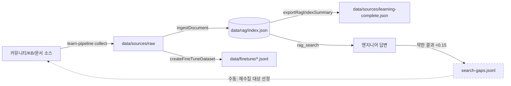
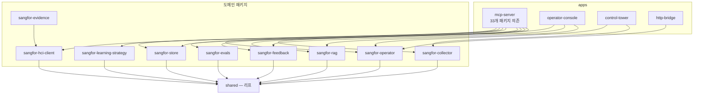
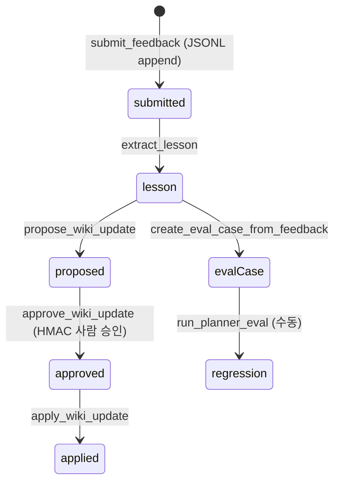

# 루프마이너 분석 — 루프화·그래프화 가능 지점

- 분석일: 2026-08-11
- 채굴 대상(실측): `package.json` 46개 npm 스크립트, `packages/*`·`apps/*` 전체 import 그래프, `data/*` 경로 reader/writer 매핑, 코드 내 루프성 구조(`flywheel`/`pipeline`/`poll` 탐색)
- 방법: 정적 채굴(임포트/문자열 경로 스캔) + 이 세션에서 실행으로 검증된 사실만 "실동작"으로 표기

## 1. 이미 존재하는 루프 (현재 상태 실측)

| ID | 루프 | 경로 근거 | 현재 상태 |
|----|------|-----------|-----------|
| L1 | 지식 수집 루프: 소스 수집 → 원문 저장 → RAG 인제스트 → 파인튜닝 데이터셋 → 요약 | `packages/sangfor-collector/src/learn-pipeline.ts`, `data/sources/raw` → `data/rag/index.json` → `data/finetune/` | 실동작 (94소스/1,249청크). 트리거는 수동(`pnpm run learn:sources`) + macOS launchd 예약 |
| L2 | 검색-갭 플라이휠: 약한 검색결과(점수<0.15) 자동 캡처 → `search-gaps.jsonl` → 피드백 | `apps/mcp-server/src/index.ts:203-235` | 캡처만 자동. 갭을 재수집 대상으로 되먹이는 소비 단계는 수동 |
| L3 | 피드백 루프: `sangfor_submit_feedback` → `sangfor_extract_lesson` → `sangfor_propose_wiki_update` → (HMAC 사람 승인) → `sangfor_apply_wiki_update`; 병렬로 `sangfor_create_eval_case_from_feedback` → `sangfor_run_planner_eval` | `apps/mcp-server/src/index.ts:900-944`, `data/feedback/`(JSONL append) | 도구 체인 연결 완료, 누적 데이터 0건. 승인 게이트는 설계상 사람 유지 |
| L4 | 학습전략 관찰 루프: `sangfor_research_learning_strategy` → `validate` → (승인) → `promote`; `attach_observation_session` → `manage_learning_capture` → `collect_facts` | `apps/mcp-server/src/index.ts:1260-1310`, `data/runtime/learning-strategies/` | 코드 완성, 실장비 파일럿 BLOCKED (VPN/CDP/키) |
| L5 | HCI 적용 수렴 루프: apply → poll → read-back verify → SUCCEEDED/HALT | `packages/sangfor-hci-client/src/apply-machine.ts`, `read-back.ts` | 완전 자동 (읽기-확인 상태기계) |

## 2. 루프화 가능한 부분 (자동화 후보)

| 후보 | 지금 | 루프를 닫으려면 | 난이도/전제 |
|------|------|-----------------|-------------|
| 검색-갭 → 재수집 | `search-gaps.jsonl`에 쌓이기만 함 | 갭 쿼리를 `learn:sources`의 수집 대상으로 변환하는 glue 하나 (주기 실행) | 낮음. 순수 파일 입출력 |
| KB 전체 재크롤 | `scripts/learn-kb-full-site.ts` 수동, 실패 시 `data/runtime/needs-glass.flag` 기록 | 스케줄러가 flag를 소비해 재시도 + glass CDP 가용성 체크 | 중간. glass CDP 의존 (현재 unreachable) |
| 재임베딩 | `scripts/rag-reembed.ts` 수동 | 인덱스에 기록된 `embeddingModel`과 현재 설정 모델 불일치 감지 시 자동 실행 | 낮음. 메타데이터 비교만 필요 |
| 플래너 평가 회귀 | `sangfor_run_planner_eval` 수동 호출 | 커밋/CI 훅에서 `data/evals/eval-cases.jsonl` 전건 실행 | 낮음. 케이스 축적이 선행 |
| 파일→DB 미러 | `scripts/sync-db.ts` 수동 | learning-strategy에 이미 있는 outbox 미러 패턴(`syncStrategyMirror`)을 RAG 문서 메타로 확장 | 중간. Postgres 연결 필요 |

루프화하면 안 되는 것(설계 고정): 위키 반영 승인, 실장비 write 승인 — HMAC 단일사용 승인으로 사람 게이트 유지 (`docs/SECURITY.md`).

## 3. 그래프화 가능한 부분

### G1. 학습 파이프라인 DAG (L1+L2 결합 — 갭 에지가 사이클을 만든다)

점선 에지(갭→소스)가 유일한 수동 구간이며, 2절의 첫 번째 후보로 자동화하면 완전한 자가개선 사이클이 된다.

### G2. 패키지 의존 그래프 (실측 임포트 에지, 계층 축약)

의존은 전부 하향(apps → packages → shared)으로 ARCHITECTURE.md 규칙과 일치함을 실측으로 확인. 예외 없음. 단, `sangfor-store`는 `sangfor-learning-strategy`를 상대경로로 임포트한다(미러 어댑터) — 그래프화 시 추적할 유일한 수평 에지.

### G3. 피드백·승인 상태 그래프 (L3)

### G4. 데이터 자산 그래프 (reader/writer 실측 상위)

`data/rag/index.json`은 14개 모듈이 접근하는 최대 공유 자산(단일 쓰기 락으로 보호됨), `data/sources/raw`는 7개, `data/evidence`는 6개. 이 세 파일/디렉터리가 그래프 시각화·모니터링 1순위다.

## 4. 이 분석과 함께 처리된 운영 문제

- 저장소 내 11개 스크립트가 구식 macOS 체크아웃 절대경로(`/Users/jmpark/Documents/Playground/...`)를 하드코딩하고 있었음 → 스크립트 위치 기준 상대경로로 전부 치환 (예약 자동화가 어느 체크아웃에서 돌아도 자기 저장소를 가리킴).
- 머신 외부라 여기서 해결 불가(보고만): macOS launchd 예약 잡 자체의 대상 경로 갱신, `data/runtime/needs-glass.flag`의 `glass_cdp_unreachable` (VPN/CDP 가용성 필요).
