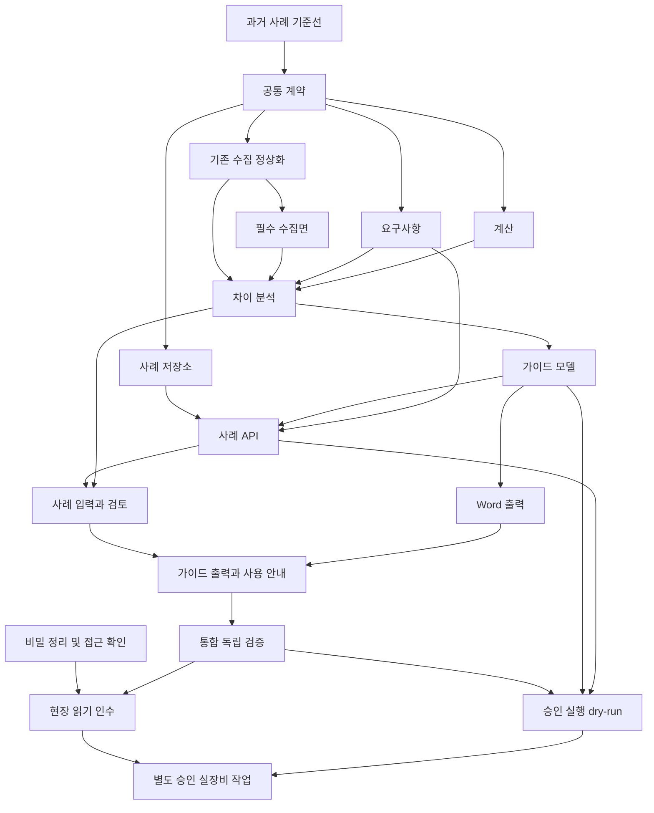

# 엔지니어 업무 재현·위임 개발·독립 인수 상세 계획

**Status: Draft — 개발 계약 초안. 구현·현장 인수 완료 아님.**
작성 기준: 2026-09-09, main `cd8e44db41b8fcd7aad4d6c052c3dd008c1e27d4`.
상위 프로그램: [#90](https://github.com/whelp99-code/whelp99-code-sangfor-engineer-mcp/issues/90). 계획 작성: [#91](https://github.com/whelp99-code/whelp99-code-sangfor-engineer-mcp/issues/91).
주관: 현재 작업의 검증·통합 에이전트. 개발: Issue별 지정된 별도 에이전트. 제품 PM 및 실제 장비 변경 승인: 사용자.

## 1. 목표와 완료의 의미

사용자는 고객 요구사항과 업무 우선순위를 전달하고 PM으로 검토·승인한다. 엔지니어 에이전트는 실제 장비 정보를 수집하고, 확인된 값으로 계산·점검하고, 요구사항과 현재 상태의 차이를 찾아 초기 구축 가이드를 작성한다. 후속 단계에서는 별도 승인된 가이드의 한 동작을 수행하고 독립 재조회로 결과를 확인한다.

검색 품질, 도구 개수, 테스트 개수, 파일 생성 성공은 보조 지표다. 완료 판정은 **한 실제 업무의 입력부터 검토 가능한 산출물까지 연결되는가**로 한다.

- **Phase A / 우선 목표:** 기존 환경 1건의 읽기 수집·계산·요구사항 추적·Word 가이드, 신규 구축 1건의 제공 사양·요구사항 기반 가이드. 미확인과 가정이 드러나고 PM이 실제 작업 준비에 사용할 수 있어야 한다.
- **Phase B / 이후 목표:** Phase A에서 검토한 가이드와 연결된 단일 가역 동작의 dry-run, 정확한 PM 승인, 실제 실행, 별도 독립 read-back. 성공 범위는 해당 제품/firmware/target/action으로 한정한다.
- 이번 요청의 산출물은 상세 계획과 개발 인계 계약이다. 하위 개발 Issue를 등록했다고 구현을 시작하거나 특정 고객 장비 접근·변경을 승인한 것은 아니다.
- LightRAG 교체, 모든 제품 동시 완성, 모델 학습, 무인 변경, 자동 rollback, 고객 자동 발송은 범위 밖이다.

## 2. 현재 기준선: 재사용할 것과 부족한 것

이번 조사는 소스와 기록을 읽은 감사다. 아래 역사적 사실은 현재 환경에서 새로 실행한 결과와 구분한다.

| 영역 | 확인된 구현/기록 | 정확한 한계 및 이번 결정 |
| --- | --- | --- |
| HCI 과거 실장비 조회 | 과거 runbook에 인증·compute/image 읽기 성공 기록이 있음 | 원증거와 현재 대상 유효성은 E00/E12에서 확인. 과거 기록을 current live PASS로 재분류하지 않음 |
| 현재 HCI 수집 | `inventory.ts`는 volumes/servers/images, 수집 시각·출처·실패·부분 여부를 반환 | host CPU/RAM·network·HA 등 전체 구축 정보 아님. 기존 수집 정상화와 필수 추가 수집을 별도 PR로 분리 |
| HCI 모니터 | `ops-monitor.ts`는 freshness/completeness와 volume status 판정 | 전체 클러스터 정상 판정으로 확장 금지 |
| 설정 점검 | `sangfor-spec`에 결정적 비교 및 INDETERMINATE 처리 존재 | 실제 사례·요구사항·계산 결과를 넣는 연결 필요. 다른 제품 mapper의 missing→false 가능성은 적용 범위별로 확인 |
| 사이징 | `sangfor-sizing`은 주 입력 1종과 외부 임계값으로 티어 제안 | 정확한 용량/HA/BOM 계산기 아님. 임계값은 provisional heuristic이며 산술·공식 정책·자문을 구분해야 함 |
| 프로젝트 분석/계획 | 규칙·키워드·고정 템플릿, 관련 문서 검색 사용 | 내부 LLM이 모든 계산/설계를 하는 구조 아님. `grounding-assessment.ts`는 현재 항상 `answerReady:false` |
| Word 생성 | 과거 26항목 Excel에서 실제 Word 생성 기록; 기존 builder와 XML 테스트 존재 | 고객 설정값의 정확성, 문서 사용성, 현재 배포 전체 흐름을 증명하지 않음 |
| UI | 분석·계획·검색·가져오기가 각각 존재 | 하나의 사례에서 값과 revision을 연결하며 가이드를 검토·내려받는 흐름 부족 |
| 저장 | authority/run/evidence/RLS 기반 존재 | 가이드/사례의 원자적 저장·재개 연결 필요. 저장 실패를 성공으로 숨기는 경로 재검토 |
| 실행 | 승인·nonce·read-back·불확실 처리 구현 존재 | fixture 성공과 실장비 지원은 다름. 지원 evidence 없는 action은 계속 거절 |

**정정:** 기존에도 실제 도구와 규칙 코드로 처리한 부분이 있었다. LLM은 문맥 해석과 도구 연결을 맡을 수 있지만, 과거 각 작업에서 어떤 호출을 했는지는 당시 증거가 있어야 확정할 수 있다. 이번 계획은 그 수동 연결을 추적 가능하고 반복 가능한 제품 흐름으로 바꾼다.

### 근거 파일

- [HCI 수집](../../packages/sangfor-hci-client/src/inventory.ts), [HCI 상태 점검](../../packages/sangfor-hci-client/src/ops-monitor.ts)
- [판정 엔진](../../packages/sangfor-spec/src/evaluate.ts), [사이징](../../packages/sangfor-sizing/src/index.ts)
- [계획기](../../packages/sangfor-planner/src/index.ts), [근거 준비도](../../packages/sangfor-planner/src/grounding-assessment.ts)
- [Excel 계획](../../packages/sangfor-product-adapters/src/excel-planning.ts), [Word builder](../../packages/sangfor-product-adapters/src/docx-builder.ts)
- [과거 문서 생성 기록](../START_HERE_TODAY.md), [보안 계약](../SECURITY.md), [구조](../../ARCHITECTURE.md)

과거 장비 runbook에서 평문 비밀 노출이 발견됐다. 값은 이 계획이나 Issue에 복사하지 않는다. E02는 현재 파일 정리와 자격 증명 폐기·교체의 완료를 분리한다. 기존 비밀을 재현 편의 때문에 재사용하지 않는다.

## 3. 아키텍처 결정과 값의 책임

### 결정

새 범용 에이전트 프레임워크를 만들지 않는다. 기존 client/config-state/spec/sizing/planner/product-adapter/office/authority를 얇은 사례 조립 계층으로 연결한다. 순수 계약만 L0에 두고 도메인 조립은 적절한 상위 package에 둔다. 앱은 인증·입출력·화면 책임만 가진다. 현재 의존 방향을 바꿔야 한다면 구현 전에 별도 ADR로 판단한다.

### 값의 출처 계약

| 값 종류 | 의미 | 필수 증거 | 허용하지 않는 변환 |
| --- | --- | --- | --- |
| observed | 허가된 장비에서 실제 읽은 값 | target/scope/firmware/time/surface/collection/evidence | 누락을 0/false로 채우기 |
| provided | 고객/PM이 제공한 사양·현재값 | 입력 원문 위치·revision·제공자 확인 상태 | 실제 조회값인 것처럼 표시 |
| derived | 검증된 수식으로 계산 | formula ID/version, input IDs, 단위, 가정 | LLM 산술을 공식 계산으로 저장 |
| proposed | 적용을 제안하는 값 | requirement와 제품/버전 근거, 결정 필요 여부 | 승인됐거나 적용됐다고 표시 |
| unknown | 없거나 신뢰할 수 없는 값 | 구체적 이유와 필요한 다음 확인 | 성공·정상·미해당으로 숨기기 |

대표 계약 필드(이름은 E01에서 기존 타입과 조정):

- Case: schemaVersion, caseId, tenant/project/actor의 인증 문맥, mode(existing/new), product, firmware, revision, status.
- Observation: id, sourceKind, typed value/unit, target, collectedAt, collectionStatus, evidenceRef, freshnessPolicy.
- Requirement: id, 원문 sourceRef, normalized target/constraint, priority, confirmationState, acceptanceCriterion, revision.
- Calculation: id, formulaId/version, inputRefs, units, assumptions, result 또는 unavailableReason.
- Assessment: requirementRef, currentRef, desiredRef, calculationRefs, status, reasons, nextAction.
- Guide: immutable revision/digest, requirementRefs, ordered steps, current/proposed values, prerequisites, evidence/citations, verify/stop/recovery instructions, unresolved, readiness.
- Evidence: opaque artifact ID, owner/scope, content digest, media type, sanitized status, retention rule. 다운로드에서 raw 서버 경로를 받지 않는다.

사례 진행 상태와 개별 판정은 별개다. 계획상 사례 흐름은 `draft → inputs_pending → assessment_ready → guide_draft → pm_review → accepted`이며, 실패·미확인 시 해당 단계에 이유를 남긴다. 실행 상태는 기존 실행 상태 기계를 사용한다. `accepted` 문서가 장비 실행 승인이나 실행 PASS를 의미하지 않는다.

### 변경·저장 규칙

요구사항이나 관측 snapshot이 바뀌면 의존 계산·판정·가이드는 stale다. 가이드 승인 뒤 변경되면 새 revision으로 재검토한다. 동시 편집은 revision 비교로 거절한다. 저장 실패는 명시적 미저장 상태이고, 미저장 초안은 durable 승인·재개가 불가능하다. authority 사용 시 DB 실패를 로컬 파일 fallback으로 숨기지 않는다.

## 4. Issue와 PR 구성

아래는 기본 **18개 작업 단위**, 계획 작성 Issue 및 상위 Epic은 별도다. 각 단위의 범위를 더 나눌 필요가 입증되면 구현 전에 child Issue를 추가한다. 계획 PR은 #91만 닫고 Epic #90과 구현 Issue는 닫지 않는다.

| 단위 | 실제 Issue | Phase | 선행 단위 | 대표 PR 산출물 |
| --- | --- | --- | --- | --- |
| E00 | [#92](https://github.com/whelp99-code/whelp99-code-sangfor-engineer-mcp/issues/92) 과거 고객 업무 재현과 현재 기능 기준선 고정 | A0 | 없음 | S: 코드보다 조사·재현 위주, 원본 확보는 외부 의존 |
| E01 | [#93](https://github.com/whelp99-code/whelp99-code-sangfor-engineer-mcp/issues/93) 사례·관측값·요구사항·계산·가이드 공통 계약 | A0 | E00 | M: 이후 PR의 선행 계약 |
| E02 | [#94](https://github.com/whelp99-code/whelp99-code-sangfor-engineer-mcp/issues/94) 과거 문서 비밀정보 정리와 현장 접근 자격 증명 확인 | A0 | 없음 | S 코드 + 운영 완료는 담당자/대상 권한 의존 |
| E03A | [#95](https://github.com/whelp99-code/whelp99-code-sangfor-engineer-mcp/issues/95) HCI 기존 읽기 수집의 완전성·정규화 연결 | A1 | E01 | M; 신규 API는 공식 응답/실측 증거 없으면 지원 불가로 남김 |
| E03B | [#96](https://github.com/whelp99-code/whelp99-code-sangfor-engineer-mcp/issues/96) 대표 구축 사례에 필요한 HCI 추가 수집면 구현 | A1 | E03A | M; 서로 다른 transport가 필요하면 각 adapter를 child Issue/PR로 먼저 분할 |
| E04 | [#97](https://github.com/whelp99-code/whelp99-code-sangfor-engineer-mcp/issues/97) 고객 요구사항 입력·Excel 매핑·미확인 질문 추적 | A1 | E01 | M |
| E05 | [#98](https://github.com/whelp99-code/whelp99-code-sangfor-engineer-mcp/issues/98) 단위·근거·누락을 보존하는 결정적 계산과 점검 | A1 | E01 | M |
| E06 | [#99](https://github.com/whelp99-code/whelp99-code-sangfor-engineer-mcp/issues/99) 현재 상태·요구사항·계산을 연결하는 차이 분석 | A2 | E03A, E04, E05, E03B | M |
| E07 | [#100](https://github.com/whelp99-code/whelp99-code-sangfor-engineer-mcp/issues/100) 실측 근거를 가진 구축 가이드 모델과 준비도 판정 | A2 | E06 | M/L: 너무 크면 비공개 계약 도입과 caller 전환을 별도 child Issue로 먼저 분할 |
| E08 | [#101](https://github.com/whelp99-code/whelp99-code-sangfor-engineer-mcp/issues/101) 동일 가이드에서 Word·검토용 결과 출력 | A3 | E07 | M |
| E09A | [#102](https://github.com/whelp99-code/whelp99-code-sangfor-engineer-mcp/issues/102) 권한 저장소의 사례 aggregate·원자성·scope·동시성 | A1 | E01 | M: 저장 계약과 구현만 |
| E09B | [#108](https://github.com/whelp99-code/whelp99-code-sangfor-engineer-mcp/issues/108) 사례 API의 저장·재개·revision 충돌 연결 | A1 | E09A, E04, E07 | M: API adapter만 |
| E10A | [#103](https://github.com/whelp99-code/whelp99-code-sangfor-engineer-mcp/issues/103) 사례 입력·수집·미확인·계산 검토 화면 | A3 | E04, E06, E09B | M: 가이드/다운로드 제외 |
| E10B | [#109](https://github.com/whelp99-code/whelp99-code-sangfor-engineer-mcp/issues/109) 가이드 검토·다운로드·진행 재개·첫 사용 안내 | A3 | E10A, E08, E09B | M: 검토/출력과 안내만 |
| E11 | [#104](https://github.com/whelp99-code/whelp99-code-sangfor-engineer-mcp/issues/104) 독립 기대값으로 전체 업무 인수 하네스와 통합 회귀 | A4 | E03A, E04, E05, E06, E07, E08, E09B, E10B, E03B | M; 부모 검증 oracle 작성은 E00 이후 병렬 시작 가능 |
| E12 | [#105](https://github.com/whelp99-code/whelp99-code-sangfor-engineer-mcp/issues/105) 허가된 장비 읽기와 구축 가이드 현장 인수 | A5 | E00, E02, E11 | 현장 가용성 의존; 임의 날짜/통과율 약속 없음 |
| E13 | [#106](https://github.com/whelp99-code/whelp99-code-sangfor-engineer-mcp/issues/106) 가이드 revision에 결합된 승인 실행의 dry-run 연결 | B1 | E07, E09B, E11 | M/L: 선택한 단일 action만 |
| E14 | [#107](https://github.com/whelp99-code/whelp99-code-sangfor-engineer-mcp/issues/107) PM 별도 승인 하에 단일 가역 작업 실행·독립 재조회 인수 | B2 | E02, E12, E13 | 운영 승인·지원 capability 의존, 당일 완료 보장 없음 |

### 선행 관계와 병렬 실행

- Wave 0: E00과 E02를 독립 진행. E01은 기준선 뒤. E02의 외부 운영 부분이 지연되어도 fixture 개발은 진행한다.
- Wave 1: E01 계약이 동결되면 기존 수집(E03A), 요구사항(E04), 계산(E05), 저장소(E09A)를 병렬 배정한다. E03B는 E03A 이후다. 실제 가용 agent 수보다 많은 작업은 대기열에 둔다.
- Wave 2: E06, E07 순서. 사례 API(E09B)는 E07·E09A·E04 이후, 화면 통합 전에 연결한다. 문서/UI 에이전트는 E01 뒤 fixture 설계를 준비할 수 있지만 미완성 계약을 추측해 별도 구현하지 않는다.
- Wave 3: E08, E10A/E10B 통합. 검증 에이전트는 E00부터 독립 기대값을 준비하고 E11에서 최종 integrated commit을 인수한다.
- Wave 4: E12 현장 읽기·문서 인수. E13 mock 개발은 E11 이후 가능하나 실제 쓰기 인수는 E12 완료 후 E14에서만 한다.
- 계약 변경은 영향을 받는 에이전트에게 전달하고 의존 테스트를 재실행한다. 공유 worktree의 동시 파일 수정 대신 Issue별 worktree와 서로 다른 소유 파일을 사용한다.

### 기존 Issue와의 관계

| 기존 범위 | 이번 범위 | 처리 원칙 |
| --- | --- | --- |
| #30, #35 전체 프로그램/기준선 | E00/E11은 특정 업무 사례의 기준선·인수 | 전체 제품 프로그램을 대체하지 않음 |
| #48–#58 authority/DB/JM/remote | E03A/E03B/E09A/E09B가 기존 구현을 사용 | Issue 열림만으로 미구현을 가정하지 않음. exact 코드·증거로 선행 능력을 확인 |
| #67 HCI 구축·이전·DR | 대표 사례 필수 수집·계산·가이드만 | 전체 HCI lifecycle를 완료로 닫지 않음 |
| #71 전체 제품 7 lifecycle | Phase A는 1개 대표 제품의 2개 사례 | 16/16 완성 주장 금지 |
| #40–#47, #59 실행 | E13/E14는 하나의 검증된 가역 action | 기존 승인·현장 evidence gate 유지, 새로운 shortcut 금지 |
| #72/#73 문서·전체 closeout | 이 프로그램의 정확한 결과만 제공 | 원래 전체 인수 기준은 그대로 유지 |
| #88 / 배포 문서 PR #89 | 기존 운영 기반 | 실행 기반이 있다고 고객 업무가 검증된 것은 아님; 본 계획에서 자동 병합/종료하지 않음 |

legacy Issue의 오래된 모델 라벨이나 CLI 명령은 새 실행 정책이 아니다. 현재 AGENTS와 package.json을 우선하고 고정 모델 라우팅을 부활시키지 않는다.

## 5. 작업 단위별 상세 계약

모든 단위의 입력은 선행 PR의 검증된 commit, E00 사례 manifest, 기존 보안/구조 계약이다. 산출물은 해당 PR, 테스트 결과, source/commit에 묶인 evidence receipt다. E02/E12/E14는 코드·문서 반영과 외부 운영 인수를 별도로 추적한다.

### E00 [#92](https://github.com/whelp99-code/whelp99-code-sangfor-engineer-mcp/issues/92) — 과거 고객 업무 재현과 현재 기능 기준선 고정

**Phase:** A0 · **선행:** 없음 · **범위:** S: 코드보다 조사·재현 위주, 원본 확보는 외부 의존

**작업 대상:**

- `docs/START_HERE_TODAY.md`
- `packages/sangfor-hci-client/src/inventory.ts`
- `packages/sangfor-product-adapters/src/excel-planning.ts`
- `tests/fixtures/engineer-workflow/ (신규)`
- `tests/engineer-workflow-baseline.test.ts (신규)`

**구현 순서:**

1. 과거 HCI 읽기 및 26항목 Excel 문서 생성 기록의 날짜·대상 범위·원본 존재 여부를 비밀 없이 조사한다. 실제 원본 확보 여부와 기록만 존재함을 분리한다.
2. 기존 도구 호출 순서를 재현하고 수동 LLM 연결 단계, 실제 코드 실행 단계, 미구현 단계를 목록화한다. 기존 문서에 적힌 PASS를 현재 PASS로 가져오지 않는다. E00 실행은 fixture와 보관된 입력에 한정한다. 과거 다제품 Excel 재현과 새 HCI 기준선은 별도 manifest로 유지한다.
3. 대표 사례를 HCI 현재 상태 점검+요구사항 반영으로 잠정 선택한다. 과거 사례가 다른 제품이면 원본 재현과 HCI 구현 범위를 별개로 기록한다.
4. sanitized 원본·기대값·출처·해시·라이선스/보관 가능 범위·firmware를 case manifest로 고정한다. 원본이 없으면 synthetic 대체 사례임을 표시하고 실제 재현 인수는 미완료로 남긴다.

**완료·인수 기준:**

1. baseline에 capability별 implemented/fixture_verified/historical_live/current_live/unknown을 모두 기재한다.
2. 1개 기존 환경 사례와 1개 신규 구축 사례의 입력·예상 출력·필수 값 목록을 고정한다.
3. 기존 수집 범위 및 부족한 항목을 숫자로 집계하되 제품 전체 커버리지로 확대하지 않는다.

**거절·실패 검증:**

1. 원본 부재를 실측으로 표시하면 실패
2. fixture provenance를 live로 바꾸면 실패
3. 비밀 문자열이 보고서나 fixture에 남으면 실패

**검증 명령·방법:**

1. pnpm test -- tests/hci-inventory-completeness.test.ts tests/planner-grounding-v5.test.ts tests/spec-report-docx.test.ts
2. pnpm test -- tests/engineer-workflow-baseline.test.ts (이 PR에서 추가 후)

**제외:** 장비 접속, 고객 문서 외부 전송, 신규 계산기, 기능 완성 판정은 제외한다.

### E01 [#93](https://github.com/whelp99-code/whelp99-code-sangfor-engineer-mcp/issues/93) — 사례·관측값·요구사항·계산·가이드 공통 계약

**Phase:** A0 · **선행:** E00 [#92](https://github.com/whelp99-code/whelp99-code-sangfor-engineer-mcp/issues/92) · **범위:** M: 이후 PR의 선행 계약

**작업 대상:**

- `packages/shared/src/ (순수 계약만)`
- `packages/sangfor-config-state/src/provenance.ts`
- `packages/sangfor-planner/src/ (검증과 조립)`
- `tests/engineer-case-contract.test.ts (신규)`

**구현 순서:**

1. 기존 provenance를 재사용해 caseId/revision/scope/product/firmware와 관측값·요구사항·계산·가이드의 ID 연결을 정의한다.
2. 각 값은 observed/provided/derived/proposed/unknown 중 하나이며 값·단위·시각·source/evidence ID·수집 완전성·불확실 사유를 보존한다.
3. 상태는 사례 진행, 개별 항목 판정, 문서 준비도, 실행 결과를 분리한다. null/unknown과 실제 0/false를 구분한다.
4. 버전 있는 JSON 계약과 strict validator, 이전 입력에 대한 명시적 호환·거절 정책을 구현한다. shared에는 상위 도메인/DB/UI 의존성을 넣지 않는다.

**완료·인수 기준:**

1. 모든 값은 출처 종류를 갖고 derived는 입력 ID와 수식 버전을 갖는다.
2. tenant/project/actor는 인증된 실행 문맥에서 확정하고 입력 본문의 주장만 신뢰하지 않는다.
3. guide ready 판정은 계약 검증만으로 자동 부여되지 않는다.

**거절·실패 검증:**

1. cross-project 참조, 잘못된 ID 연결, unsupported schema version 거절
2. NaN/Infinity/잘못된 단위·날짜·중복 ID 거절
3. unknown을 0 또는 PASS로 직렬화하면 실패

**검증 명령·방법:**

1. pnpm test -- tests/config-state-provenance.test.ts tests/spec-provenance.test.ts
2. pnpm test -- tests/engineer-case-contract.test.ts (추가 후)

**제외:** 새 범용 프레임워크/새 승인 체계/광범위 패키지 분해는 제외한다.

### E02 [#94](https://github.com/whelp99-code/whelp99-code-sangfor-engineer-mcp/issues/94) — 과거 문서 비밀정보 정리와 현장 접근 자격 증명 확인

**Phase:** A0 · **선행:** 없음 · **범위:** S 코드 + 운영 완료는 담당자/대상 권한 의존

**작업 대상:**

- `docs/M4_HCI_API_SPIKE_RUNBOOK.md (민감 내용 출력 금지)`
- `docs/SECURITY.md`
- `승인된 비공개 자격 증명 저장소`

**구현 순서:**

1. 발견 위치만 기록하고 값은 출력·인용·Issue 복사하지 않는다. 접근 가능한 문서의 민감값을 자리표시자와 안전한 참조 방법으로 바꾼다.
2. 재발 방지를 위해 변경 문서의 비밀 검사 방법을 기록한다. 필요 시 기존 검사에 맞는 최소 회귀 검사를 추가한다.
3. 해당 비밀의 유효 여부와 소유자를 안전한 경로로 확인하고 권한 있는 담당자가 폐기·교체한 영수증을 값 없이 남긴다. 외부 장비 자격 증명 변경은 이 계획으로 임의 실행하지 않는다.
4. Git 현재 파일 제거와 과거 history 노출은 별개라고 기록한다. history rewrite나 강제 push는 별도 결정으로 남긴다.

**완료·인수 기준:**

1. 변경 문서·신규 계획·fixture에 원문 비밀이 없다.
2. 현장 접근 전에 유효 자격 증명 출처와 노출된 값의 폐기/교체 여부를 확인한다.
3. 코드 PR 완료와 자격 증명 정리의 운영 완료를 별도 체크한다.

**거절·실패 검증:**

1. 스캐너 출력에 원문 노출 금지
2. 현재 파일 삭제만으로 유출 대응 완료라 하면 실패

**검증 명령·방법:**

1. git diff --check
2. 변경 파일만 대상으로 비밀값을 출력하지 않는 검사 및 수동 검토

**제외:** 임의 비밀번호 교체, 전체 Git history 재작성, 외부 연락은 제외한다.

### E03A [#95](https://github.com/whelp99-code/whelp99-code-sangfor-engineer-mcp/issues/95) — HCI 기존 읽기 수집의 완전성·정규화 연결

**Phase:** A1 · **선행:** E01 [#93](https://github.com/whelp99-code/whelp99-code-sangfor-engineer-mcp/issues/93) · **범위:** M; 신규 API는 공식 응답/실측 증거 없으면 지원 불가로 남김

**작업 대상:**

- `packages/sangfor-hci-client/src/inventory.ts`
- `packages/sangfor-hci-client/src/provenance.ts`
- `packages/sangfor-hci-client/src/ops-monitor.ts`
- `packages/sangfor-config-state/src/`
- `apps/mcp-server/src/ 관련 HCI handler`

**구현 순서:**

1. 기존 REST inventory와 JM browser 경계를 재사용한다. target·scope·firmware·허용 읽기 surface를 명시한 수집 요청을 만든다.
2. 선택 사례에 필요한 항목만 capability matrix에 추가한다. volumes/servers/images 수집을 cluster/network 전체 검증으로 표현하지 않는다.
3. pagination은 페이지 수/시간 상한과 same-origin 검증을 두고 순회하거나 partial로 남긴다. 부분/실패 응답과 실제 빈 목록을 구분한다.
4. API 미지원·권한 부족·브라우저 미연결 시 수동 import 경로와 missing-field 목록을 제공한다. 수동 입력을 observed로 승격하지 않는다.
5. 마스킹 이후 case snapshot에 넣고 새 collection revision을 만든다. 비밀·세션·쿠키는 JM에 유지한다. 이 PR은 순수 snapshot 계약을 반환하고 실제 저장·revision 발행은 E09A/E09B가 소유한다.

**완료·인수 기준:**

1. 선택 사례의 필수 필드마다 collected/provided/missing과 이유를 제공한다.
2. mock에서 읽기 요청 외 mutation dispatch 0건, 재시도는 읽기·상한 범위로 제한한다.
3. 현재 관측값에 장비/시각/endpoint·field provenance와 collection completeness가 남는다.

**거절·실패 검증:**

1. 인증 실패·시간 초과·일부 페이지·스키마 변경·잘못된 target
2. pagination의 외부 origin 이동 거절
3. 조회 실패를 빈 정상 장비로 판정하지 않음

**검증 명령·방법:**

1. pnpm test -- tests/hci-client-provenance.test.ts tests/hci-inventory-completeness.test.ts tests/hci-ops-monitor.test.ts
2. pnpm run check:browser-boundary

**제외:** 전체 제품 수집기 및 실제 장비 쓰기, 임의 고객 접속은 제외한다. 실장비 인수는 E12. host/network/HA 신규 수집면은 E03B에서 별도 PR로 처리한다.

### E03B [#96](https://github.com/whelp99-code/whelp99-code-sangfor-engineer-mcp/issues/96) — 대표 구축 사례에 필요한 HCI 추가 수집면 구현

**Phase:** A1 · **선행:** E03A [#95](https://github.com/whelp99-code/whelp99-code-sangfor-engineer-mcp/issues/95) · **범위:** M; 서로 다른 transport가 필요하면 각 adapter를 child Issue/PR로 먼저 분할

**작업 대상:**

- `packages/sangfor-hci-client/src/ (지원 근거가 있는 adapter만)`
- `packages/jm-execution/ (필요한 읽기 경로만)`
- `tests/engineer-required-observations.test.ts (신규)`

**구현 순서:**

1. E00 필수 항목과 기존 3개 surface의 차이를 기준으로 host CPU/RAM, storage, network, HA 중 사례에 필요한 최소 필드만 선정한다.
2. 각 필드의 공식 API/실제 읽기 화면 근거와 지원 firmware를 확보한다. URL·selector·값을 LLM이 추측해 채우지 않는다.
3. 근거가 있는 읽기 adapter를 기존 계약에 연결한다. API 불가 시 승인된 JM browser 읽기 또는 provided 수동 입력으로 대체하며 출처 종류를 보존한다.
4. 필수 필드를 얻지 못하면 코드 개발은 명시적 unsupported/unknown을 반환할 수 있지만 현장 가이드 인수 blocker를 해소한 것으로 집계하지 않는다.

**완료·인수 기준:**

1. 각 필드에 지원 버전·수집 경로·권한·증거·완전성이 정의된다.
2. 부분 응답/필드 누락은 unknown이며 false/0으로 바뀌지 않는다.
3. 사례의 필수 입력이 자동 수집인지 수동 제공인지 사용자에게 표시된다.

**거절·실패 검증:**

1. API/DOM 변경·권한 부족·미지원 firmware
2. missing boolean과 실제 false의 혼동
3. 위조된 endpoint 또는 외부 origin 이동

**검증 명령·방법:**

1. pnpm test -- tests/engineer-required-observations.test.ts (추가 후)
2. pnpm run check:browser-boundary

**제외:** 전체 HCI 기능·다른 제품 adapter 확장·실제 쓰기·대상 불명 접속은 제외한다.

### E04 [#97](https://github.com/whelp99-code/whelp99-code-sangfor-engineer-mcp/issues/97) — 고객 요구사항 입력·Excel 매핑·미확인 질문 추적

**Phase:** A1 · **선행:** E01 [#93](https://github.com/whelp99-code/whelp99-code-sangfor-engineer-mcp/issues/93) · **범위:** M

**작업 대상:**

- `packages/sangfor-product-adapters/src/excel-planning.ts`
- `packages/sangfor-product-adapters/src/requirement-planning.ts`
- `packages/sangfor-planner/src/index.ts`
- `tests/engineer-requirements.test.ts (신규)`

**구현 순서:**

1. 텍스트/기존 Excel parser의 결과를 요구사항 ID·원문 위치·우선순위·명시된 제품/버전·조건·확인 상태에 매핑한다.
2. 기존 환경과 신규 구축 모드를 구분한다. 요구사항의 목표값을 실제 장비 값에 덮어쓰지 않는다.
3. 충돌·중복·모호한 단위·누락을 질문 목록으로 만든다. 고객이 확인하지 않은 LLM 추론은 proposed로 보존한다.
4. 변경된 요구사항 revision이 의존 계산/가이드에 stale 상태를 전파하도록 계약을 구현한다. 문서 지시문은 권한/명령이 아닌 데이터로 처리한다.

**완료·인수 기준:**

1. 고정 26항목 원본 확보 시 26/26 추적; 없으면 별도 표시한 fixture N/N 추적, 26항목 실제 재현으로 주장하지 않음
2. 모든 요구사항은 satisfied/change_needed/unresolved/not_applicable 판정의 입력이 된다.
3. unknown은 자동 기본값으로 치환하지 않는다.

**거절·실패 검증:**

1. malformed/과대 Excel·경로 traversal·다른 고객 파일 참조 거절
2. 문서 내 비밀 추출/임의 도구 실행 지시 무시
3. 동일 항목의 상충 목표값은 자동 선택하지 않음
4. 요구사항 수정·삭제 뒤 옛 계산/가이드 stale 전파 누락 실패

**검증 명령·방법:**

1. pnpm test -- tests/product-adapters.test.ts tests/product-adapters-decomposition.test.ts
2. pnpm test -- tests/engineer-requirements.test.ts (추가 후)

**제외:** LLM 학습/새 모델 도입/사용자 원문 강제 수정은 제외한다.

### E05 [#98](https://github.com/whelp99-code/whelp99-code-sangfor-engineer-mcp/issues/98) — 단위·근거·누락을 보존하는 결정적 계산과 점검

**Phase:** A1 · **선행:** E01 [#93](https://github.com/whelp99-code/whelp99-code-sangfor-engineer-mcp/issues/93) · **범위:** M

**작업 대상:**

- `packages/sangfor-sizing/src/index.ts`
- `packages/sangfor-spec/src/evaluate.ts`
- `packages/sangfor-hci-client/src/ops-monitor.ts`
- `tests/engineer-calculations.test.ts (신규)`

**구현 순서:**

1. E00 사례에서 실제 필요한 계산 3종을 먼저 고정한다. 후보는 확인된 총량/사용량의 잔여량·사용률, 명시된 수요 대비 여유량이다. N+1·복제/예약 반영은 정확한 topology와 공식 조건이 있을 때만 지원한다.
2. 단위 환산(GB/GiB 등), 0 분모, rounding, 음수·초과·오래된 입력 처리 규칙을 수식별로 문서화한다.
3. 계산은 순수 함수가 수행하고 formulaId/version/input IDs/단위/결과/가정/판정 근거를 반환한다. LLM 산술을 공식 결과로 저장하지 않는다.
4. 기존 사이징 heuristic은 advisory 표시를 유지한다. 공식 BOM·노드 수 확정과 단순 산술 결과를 구분한다.

**완료·인수 기준:**

1. 선택 수식별 정상·경계·입력 누락·단위 혼합 테스트를 독립 수작업 oracle과 비교한다.
2. 필수 입력 하나라도 없으면 계산 불가이며 수식과 부족한 입력이 표시된다.
3. 동일 입력/수식 버전은 동일 결과. 기준값 출처 없으면 적합 PASS를 부여하지 않는다.

**거절·실패 검증:**

1. 0/음수/NaN/Infinity/overflow
2. stale·partial 관측을 최신 전체로 계산하지 않음
3. VM 수만으로 HA/용량 적합 단정 금지

**검증 명령·방법:**

1. pnpm test -- tests/sizing.test.ts tests/spec-context-dependent.test.ts tests/spec-freshness.test.ts
2. pnpm test -- tests/engineer-calculations.test.ts (추가 후)

**제외:** 공식 수치 없는 정밀 sizing/가상 측정/계산기 범용화는 제외한다.

### E06 [#99](https://github.com/whelp99-code/whelp99-code-sangfor-engineer-mcp/issues/99) — 현재 상태·요구사항·계산을 연결하는 차이 분석

**Phase:** A2 · **선행:** E03A [#95](https://github.com/whelp99-code/whelp99-code-sangfor-engineer-mcp/issues/95), E04 [#97](https://github.com/whelp99-code/whelp99-code-sangfor-engineer-mcp/issues/97), E05 [#98](https://github.com/whelp99-code/whelp99-code-sangfor-engineer-mcp/issues/98), E03B [#96](https://github.com/whelp99-code/whelp99-code-sangfor-engineer-mcp/issues/96) · **범위:** M

**작업 대상:**

- `packages/sangfor-spec/src/evaluate.ts`
- `packages/sangfor-planner/src/ (사례 평가 조립)`
- `packages/sangfor-config-state/src/`
- `tests/engineer-assessment.test.ts (신규)`

**구현 순서:**

1. 요구사항마다 현재값·목표값·관련 계산·제품/버전 근거를 join하고 충족/변경 필요/미확인/해당 없음으로 판정한다.
2. 필드별 freshness·지원 버전·scope·completeness를 검사한다. 서로 충돌하는 증거는 자동 덮어쓰기하지 않는다.
3. 후속 작업을 정보 추가/재조회/설계 결정/설정 변경으로 구분하고 우선순위와 이유를 부여한다.
4. 이 사례의 요구사항 커버리지와 전체 제품 성숙도를 분리해 보고한다.

**완료·인수 기준:**

1. 필수 요구사항 100%가 판정 또는 사유 있는 unresolved로 연결된다.
2. 각 판정에서 원본 evidence와 수식 입력까지 역추적할 수 있다.
3. 문서 검색 근거만으로 현재 고객 장비 상태 PASS가 생기지 않는다.

**거절·실패 검증:**

1. wrong-product/firmware, stale/missing/conflicting observation
2. 확인 불가를 not_applicable로 숨기는 경로 거절
3. 동일 case의 다른 revision 혼합 거절
4. 요구사항 삭제 후 예전 판정을 현행으로 재사용하는 경로 거절

**검증 명령·방법:**

1. pnpm test -- tests/spec-evaluate.test.ts tests/spec-next-actions.test.ts tests/spec-context-dependent.test.ts
2. pnpm test -- tests/engineer-assessment.test.ts (추가 후)

**제외:** 새 권한 체계/LLM 자기평가 점수로 자동 인수는 제외한다.

### E07 [#100](https://github.com/whelp99-code/whelp99-code-sangfor-engineer-mcp/issues/100) — 실측 근거를 가진 구축 가이드 모델과 준비도 판정

**Phase:** A2 · **선행:** E06 [#99](https://github.com/whelp99-code/whelp99-code-sangfor-engineer-mcp/issues/99) · **범위:** M/L: 너무 크면 비공개 계약 도입과 caller 전환을 별도 child Issue로 먼저 분할

**작업 대상:**

- `packages/sangfor-planner/src/index.ts`
- `packages/sangfor-planner/src/grounding-assessment.ts`
- `packages/sangfor-product-adapters/src/requirement-planning.ts`
- `tests/engineer-guide-grounding.test.ts (신규)`

**구현 순서:**

1. 기존 템플릿은 출발점으로 재사용하되 각 step에 요구사항 ID·현재값·제안값·근거·대상·선행조건·작업 순서·검증·중지/복구 설명을 채운다.
2. 제품과 firmware에 검증된 설정 경로만 구체화한다. 지원 근거 없는 메뉴·명령은 실행 가능한 단계로 확정하지 않는다.
3. 문서 readiness와 개별 step support를 평가한다. 모든 필수 근거와 검토 조건 충족 전은 draft/blocked이며 기존 answerReady:false를 단순 true로 변경하지 않는다.
4. JSON guide revision/digest를 기준으로 미확인 사항·리스크·PM 결정 목록과 변경 이력을 만든다. LLM 설명은 검증된 구조를 바꾸지 못한다. 이 PR의 revision/digest는 순수 계약이며 durable 저장은 E09A/E09B 통합에서 처리한다.

**완료·인수 기준:**

1. 실행 가능한 모든 단계에 추적 가능한 근거와 결과 확인 방법 존재
2. 필수 blocker 0인 경우에만 검토 준비 가능; PM 승인 자체는 별도
3. 신규 구축에서는 provided 사양과 proposed 설정을 observed로 표시하지 않음
4. 이 PR이 부여할 수 있는 최고 상태는 review_ready다. approved_for_window/field_accepted는 부여하지 않는다.

**거절·실패 검증:**

1. 참조 존재만으로 근거 검증 통과 금지
2. 기존 템플릿이 firmware/수집값과 충돌하면 차단
3. 검색 문서의 도구 실행 지시가 가이드 권한을 바꾸지 않음

**검증 명령·방법:**

1. pnpm test -- tests/planner.test.ts tests/planner-grounding-v5.test.ts
2. pnpm test -- tests/engineer-guide-grounding.test.ts (추가 후)

**제외:** 자동 승인·자동 고객 발송·근거 없는 상세 명령 생성은 제외한다.

### E08 [#101](https://github.com/whelp99-code/whelp99-code-sangfor-engineer-mcp/issues/101) — 동일 가이드에서 Word·검토용 결과 출력

**Phase:** A3 · **선행:** E07 [#100](https://github.com/whelp99-code/whelp99-code-sangfor-engineer-mcp/issues/100) · **범위:** M

**작업 대상:**

- `packages/sangfor-product-adapters/src/docx-builder.ts`
- `packages/sangfor-spec/src/report-docx.ts`
- `apps/mcp-server/src/office-tool-catalog.ts`
- `tests/engineer-guide-export.test.ts (신규)`

**구현 순서:**

1. 기존 Word 생성기를 canonical guide 입력에 연결하고 숫자·판정·순서를 다시 계산하지 않는다.
2. 요약/현재 구성/계산과 가정/요구사항별 차이/작업 절차/검증/복구·중지/미확인/출처/서명란을 출력한다.
3. 동일 revision의 JSON 검토본과 DOCX를 연결한다. 미완료 문서는 초안 상태를 본문에도 명시한다.
4. 파일명·경로·scope·크기 제한 및 마스킹을 적용한다. 문서 내부 값·표·페이지 넘김을 실제 열어서 확인한다.

**완료·인수 기준:**

1. 문서의 모든 필수 수치·요구사항 ID·미확인 항목이 guide와 일치
2. 문서 열기/표 잘림/한글/단위/출처 표기를 대표 사례로 육안 검토
3. OpenXML 도구 미설치 시 검증 미실시를 표시하고 형식 적합성 검증으로 과장하지 않음

**거절·실패 검증:**

1. 경로 탈출·파일명 충돌·소유권 메타데이터 누락 거절; HTTP cross-case 다운로드 검사는 E10B 소유
2. 초안 표시 누락·숫자 반올림 불일치·누락 requirement 실패

**검증 명령·방법:**

1. pnpm test -- tests/spec-report-docx.test.ts tests/engineer-report.test.ts
2. pnpm test -- tests/engineer-guide-export.test.ts (추가 후)

**제외:** PPT 등 추가 포맷·고객 자동 전송·새 문서 엔진 도입은 제외한다. 인증된 HTTP 다운로드 경로 구현은 E10B 소유다.

### E09A [#102](https://github.com/whelp99-code/whelp99-code-sangfor-engineer-mcp/issues/102) — 권한 저장소의 사례 aggregate·원자성·scope·동시성

**Phase:** A1 · **선행:** E01 [#93](https://github.com/whelp99-code/whelp99-code-sangfor-engineer-mcp/issues/93) · **범위:** M: 저장 계약과 구현만

**작업 대상:**

- `packages/sangfor-authority/src/authority-store-contracts.ts`
- `packages/sangfor-authority/src/authority-store.ts`
- `packages/sangfor-store/`
- `tests/engineer-case-persistence.test.ts (신규)`

**구현 순서:**

1. 기존 authority aggregate와 run/evidence 저장 경계를 먼저 확인한다. 기존 저장소로 충분하면 재사용하고 신규 테이블 필요성을 ADR로 증명한 뒤 최소 migration을 추가한다.
2. case revision·관측 snapshot·요구사항 revision·guide digest·artifact owner를 원자적으로 연결한다. optimistic concurrency를 적용한다.
3. 저장 실패를 무시하는 성공 응답을 제거한다. 일시 미저장 초안은 명확히 표시하고 승인·재개 가능 상태로 취급하지 않는다.
4. BLRO authority가 활성화된 경우 로컬 fallback을 금지한다. 원문 기밀과 공개 검색 인덱스를 분리한다.

**완료·인수 기준:**

1. 프로세스 재시작 후 같은 사례와 revision·증거 참조가 복구
2. 동시 수정 충돌 감지, 다른 프로젝트 접근/참조 차단
3. DB 중단 시 durable saved/approved 성공 응답 없음

**거절·실패 검증:**

1. cross-tenant IDOR·artifact 접근·RLS 우회
2. 수정 중 재시작·부분 저장·중복 요청
3. DB 장애를 파일 저장으로 숨기는 경로 거절
4. artifact와 DB 중 하나만 저장된 부분 실패, 동일 요청 재전송의 중복 revision/guide

**검증 명령·방법:**

1. pnpm test -- tests/engineer-case-persistence.test.ts (추가 후)
2. pnpm run test:postgres:mandatory
3. pnpm run verify:rls -- --require (격리된 검증 DB 자격 증명 환경)

**제외:** 운영 DB의 임의 migration·공개 corpus 재이관·기존 DB 대체는 제외한다. API 연결과 UI 상태는 E09B 소유.

### E09B [#108](https://github.com/whelp99-code/whelp99-code-sangfor-engineer-mcp/issues/108) — 사례 API의 저장·재개·revision 충돌 연결

**Phase:** A1 · **선행:** E09A [#102](https://github.com/whelp99-code/whelp99-code-sangfor-engineer-mcp/issues/102), E04 [#97](https://github.com/whelp99-code/whelp99-code-sangfor-engineer-mcp/issues/97), E07 [#100](https://github.com/whelp99-code/whelp99-code-sangfor-engineer-mcp/issues/100) · **범위:** M: API adapter만

**작업 대상:**

- `apps/operator-console/src/api.ts`
- `apps/operator-console/src/server.ts`
- `apps/operator-console/src/runtime-boundaries.ts`
- `tests/engineer-case-api.test.ts (신규)`

**구현 순서:**

1. 기존 authenticated API에 case 저장/읽기/진행 재개/revision 비교를 얇게 연결한다. 인증 문맥의 scope를 사용한다.
2. 저장소 오류를 무시하는 성공 응답 대신 저장 실패·미저장 초안을 명확히 반환한다.
3. artifact 원자성·요청 idempotency·revision 충돌을 API 수준에서 검사한다. 저장 없는 결과를 승인 가능한 사례로 만들지 않는다.

**완료·인수 기준:**

1. API 재연결/서비스 재시작 후 동일한 저장 revision 복구
2. 다른 tenant/project case 접근과 caller가 위조한 scope 거절
3. 저장 실패가 saved/accepted로 응답되지 않음

**거절·실패 검증:**

1. cross-tenant IDOR·artifact 접근·RLS 우회
2. 수정 중 재시작·부분 저장·중복 요청
3. DB 장애를 파일 저장으로 숨기는 경로 거절
4. artifact와 DB 중 하나만 저장된 부분 실패, 동일 요청 재전송의 중복 revision/guide

**검증 명령·방법:**

1. pnpm test -- tests/engineer-case-api.test.ts (추가 후)
2. pnpm test -- tests/operator-console-auth.test.ts
3. pnpm run test:postgres:mandatory

**제외:** 새 저장소·schema·UI 화면·실제 실행 제외

### E10A [#103](https://github.com/whelp99-code/whelp99-code-sangfor-engineer-mcp/issues/103) — 사례 입력·수집·미확인·계산 검토 화면

**Phase:** A3 · **선행:** E04 [#97](https://github.com/whelp99-code/whelp99-code-sangfor-engineer-mcp/issues/97), E06 [#99](https://github.com/whelp99-code/whelp99-code-sangfor-engineer-mcp/issues/99), E09B [#108](https://github.com/whelp99-code/whelp99-code-sangfor-engineer-mcp/issues/108) · **범위:** M: 가이드/다운로드 제외

**작업 대상:**

- `apps/operator-console/AGENTS.md`
- `apps/operator-console/src/ui-layout.ts`
- `apps/operator-console/src/ui-client-actions.ts`
- `apps/operator-console/src/api.ts`
- `apps/operator-console/src/server.ts`
- `tests/operator-console-ui.test.ts`

**구현 순서:**

1. 사례 만들기 → 대상/요구사항 → 수집/입력 → 계산·미확인 검토까지 하나의 문맥으로 연결한다.
2. 입력 예시·저장/진행/실패 상태·필드별 관측/제공 구분·다음 행동을 일반 언어로 표시한다.
3. 도메인 API를 사용하며 UI에 계산/계획 로직을 복제하지 않는다. raw JSON은 보조 진단에만 둔다.

**완료·인수 기준:**

1. 코드/JSON 없이 사례 생성·요구사항 입력·수집 결과/계산/미확인 검토 가능
2. 저장 실패·수집 미연결은 완료로 표시하지 않음
3. 실제 mutation 0건

**거절·실패 검증:**

1. 401/DB 중단/수집 미연결/계산 불가/내보내기 오류/동시 편집
2. 타 사례 artifact 접근 거절
3. 저장 실패 후 완료 표시 금지

**검증 명령·방법:**

1. pnpm test -- tests/operator-console-auth.test.ts tests/operator-console-ui.test.ts
2. pnpm run test:ui (설정된 UI 환경에서)
3. 실제 브라우저 수동 E2E와 비밀 없는 화면 증거

**제외:** 가이드 미리보기/다운로드/전체 안내는 E10B; 새 채팅 UI/전체 디자인 개편 제외

### E10B [#109](https://github.com/whelp99-code/whelp99-code-sangfor-engineer-mcp/issues/109) — 가이드 검토·다운로드·진행 재개·첫 사용 안내

**Phase:** A3 · **선행:** E10A [#103](https://github.com/whelp99-code/whelp99-code-sangfor-engineer-mcp/issues/103), E08 [#101](https://github.com/whelp99-code/whelp99-code-sangfor-engineer-mcp/issues/101), E09B [#108](https://github.com/whelp99-code/whelp99-code-sangfor-engineer-mcp/issues/108) · **범위:** M: 검토/출력과 안내만

**작업 대상:**

- `apps/operator-console/AGENTS.md`
- `apps/operator-console/src/ui-layout.ts`
- `apps/operator-console/src/ui-client-actions.ts`
- `apps/operator-console/src/api.ts`
- `apps/operator-console/src/server.ts`
- `tests/operator-console-ui.test.ts`

**구현 순서:**

1. 동일 사례 revision의 가이드 미리보기와 인증된 Word 다운로드를 연결한다. raw 서버 경로 대신 artifact ID로 접근한다.
2. 새로 접속한 사용자가 목적·예시·단계·미확인 이유·다음 행동을 이해할 수 있도록 첫 사용 안내와 대표 샘플을 제공한다.
3. 현재 배포와 다른 모델명·개발 링크·mock iframe을 실제 지원/미연결 상태 설명으로 정리한다.
4. 진행 중 사례를 재개하며 내보내기 중 revision이 바뀌면 생성 문서의 정확한 revision을 표시한다.

**완료·인수 기준:**

1. 신규 사용자 브라우저 E2E: 사례 만들기부터 검토/Word 내려받기까지 완료
2. 인증·scope·artifact owner 검증으로 다른 사례 다운로드 차단
3. 재접속 후 저장된 사례 재개; 초안·현재/이전 revision 구분

**거절·실패 검증:**

1. 다운로드 401/다른 tenant·case/경로 탈출
2. export 중 revision 변경을 현재 문서로 표시
3. 미확인·저장 실패 상태를 숨기는 완료 표시

**검증 명령·방법:**

1. pnpm test -- tests/operator-console-auth.test.ts tests/operator-console-ui.test.ts
2. pnpm run test:ui (설정된 UI 환경에서)
3. 실제 브라우저 수동 E2E와 비밀 없는 화면 증거

**제외:** 고객 자동 발송·실제 변경 승인/실행 UI·새 문서 포맷 제외

### E11 [#104](https://github.com/whelp99-code/whelp99-code-sangfor-engineer-mcp/issues/104) — 독립 기대값으로 전체 업무 인수 하네스와 통합 회귀

**Phase:** A4 · **선행:** E03A [#95](https://github.com/whelp99-code/whelp99-code-sangfor-engineer-mcp/issues/95), E04 [#97](https://github.com/whelp99-code/whelp99-code-sangfor-engineer-mcp/issues/97), E05 [#98](https://github.com/whelp99-code/whelp99-code-sangfor-engineer-mcp/issues/98), E06 [#99](https://github.com/whelp99-code/whelp99-code-sangfor-engineer-mcp/issues/99), E07 [#100](https://github.com/whelp99-code/whelp99-code-sangfor-engineer-mcp/issues/100), E08 [#101](https://github.com/whelp99-code/whelp99-code-sangfor-engineer-mcp/issues/101), E09B [#108](https://github.com/whelp99-code/whelp99-code-sangfor-engineer-mcp/issues/108), E10B [#109](https://github.com/whelp99-code/whelp99-code-sangfor-engineer-mcp/issues/109), E03B [#96](https://github.com/whelp99-code/whelp99-code-sangfor-engineer-mcp/issues/96) · **범위:** M; 부모 검증 oracle 작성은 E00 이후 병렬 시작 가능

**작업 대상:**

- `tests/engineer-workflow-e2e.test.ts (신규)`
- `tests/fixtures/engineer-workflow/`
- `docs/references/engineer-workflow/ (비밀 없는 증거)`
- `기존 CI workflow (필요한 gate만)`

**구현 순서:**

1. 개발자가 출력한 답을 그대로 golden으로 저장하지 않는다. 주관 검증자가 별도 계산한 값과 수동 표시한 요구사항 매핑을 oracle로 고정한다.
2. 기존 환경/신규 구축/누락·실패·stale·충돌·wrong scope/버전/악성 입력/재시작 시나리오를 같은 사례 모델로 검증한다.
3. API/MCP 결과와 UI 미리보기·Word 산출물의 revision 및 핵심 값을 비교한다. 활성화된 fixture의 동일성은 live proof로 표시하지 않는다.
4. 최종 통합 commit에서 관련 tests/lint/build/smoke/경계 및 DB checks를 다시 실행하고 skip·환경 blocker를 기록한다.

**완료·인수 기준:**

1. 정의한 필수 필드·요구사항·실행 단계 추적률 100%, 조작된 PASS 0건
2. 계산 oracle 일치; 예상 unresolved 전부 노출; UI와 Word 값 일치
3. 원본 가용 시 과거 사례 재현과 synthetic 회귀 결과를 별도로 제시

**거절·실패 검증:**

1. 수집 실패+가이드 출력이 정상 완료로 끝나는 결함
2. 서로 다른 revision 합성
3. 테스트가 실제로 건너뛰어졌는데 PASS로 집계하는 결함

**검증 명령·방법:**

1. pnpm test
2. pnpm run lint
3. pnpm run build
4. pnpm run smoke:mcp
5. pnpm run check:browser-boundary
6. pnpm run check:data-scope-boundary
7. pnpm run test:postgres:mandatory
8. pnpm run check:hygiene

**제외:** 실장비 인수·전체 제품 16/16 달성·모델 자기 채점은 제외한다.

### E12 [#105](https://github.com/whelp99-code/whelp99-code-sangfor-engineer-mcp/issues/105) — 허가된 장비 읽기와 구축 가이드 현장 인수

**Phase:** A5 · **선행:** E00 [#92](https://github.com/whelp99-code/whelp99-code-sangfor-engineer-mcp/issues/92), E02 [#94](https://github.com/whelp99-code/whelp99-code-sangfor-engineer-mcp/issues/94), E11 [#104](https://github.com/whelp99-code/whelp99-code-sangfor-engineer-mcp/issues/104) · **범위:** 현장 가용성 의존; 임의 날짜/통과율 약속 없음

**작업 대상:**

- `docs/references/engineer-workflow/ (sanitized acceptance)`
- `docs/BLRO_OPERATIONS_RUNBOOK.md`
- `docs/JM_ENDPOINT_INSTALL.md`
- `비공개 고객 증거 저장소`

**구현 순서:**

1. 허가된 대상·제품/firmware·읽기 계정·수집 범위·자료 보관 범위를 확인한다. 과거 자격 증명은 자동 재사용하지 않는다.
2. 기존 JM 수집 경로로 실제 값을 읽고 PM 또는 독립 읽기 화면과 사례의 필수 값 전부를 대조한다. 추가 고객사 장비를 탐색하지 않는다.
3. 계산값을 원자료로 다시 계산하고 고객 요구사항을 검토한다. 불명확한 값은 unresolved로 남긴 가이드와 질문 목록을 만든다.
4. 실제 신규 구축 사양/요구사항 사례도 provided/proposed 구분과 근거를 확인한다. PM이 누락·위험·검증 방법을 읽고 수정 요청/인수 결과를 기록한다.
5. 운영 반영이 필요한 경우에만 별도 승인된 배포 변경 창과 rollback artifact를 확보하고 이 프로젝트의 런타임 서비스에 적용한다. 고객 장비를 재시작하지 않는다. 현장 인수만을 위해 재배포하지 않는다. final commit/config/schema와 결과 artifact digest를 기록한다.

**완료·인수 기준:**

1. 현장 관측 필수값 비교 일치, 계산 독립 재검산 일치, 요구사항 추적 100%
2. 미확인 필수 항목은 해결하거나 미인수로 기록; PM의 가이드 인수 기록 존재
3. 장비 읽기·신규 구축 두 사례 모두 근거가 있어야 Phase A field_accepted; synthetic이면 개발 완료만 가능
4. 필수 필드 중 자동 관측/수동 제공/미확인 건수와 비율을 별도 보고한다. 제공값으로 채운 가이드를 전체 자동 수집 완료로 표현하지 않는다.

**거절·실패 검증:**

1. 권한/원본 부재 시 NOT_RUN, 현장 성공으로 합산 금지
2. 자료 마스킹 전 외부 전송 금지
3. 새 설정 적용 및 정책 변경 0건

**검증 명령·방법:**

1. E11 통합 결과 확인
2. 실제 대상 읽기 수집과 독립 대조 (대상 승인 후)
3. 프로젝트 runtime 변경이 있을 때만 승인된 배포·재시작 smoke; 고객 장비 재시작 없음

**제외:** 고객 장비 설정·자격 증명 임의 변경·고객 자동 납품은 제외한다.

### E13 [#106](https://github.com/whelp99-code/whelp99-code-sangfor-engineer-mcp/issues/106) — 가이드 revision에 결합된 승인 실행의 dry-run 연결

**Phase:** B1 · **선행:** E07 [#100](https://github.com/whelp99-code/whelp99-code-sangfor-engineer-mcp/issues/100), E09B [#108](https://github.com/whelp99-code/whelp99-code-sangfor-engineer-mcp/issues/108), E11 [#104](https://github.com/whelp99-code/whelp99-code-sangfor-engineer-mcp/issues/104) · **범위:** M/L: 선택한 단일 action만

**작업 대상:**

- `packages/sangfor-product-adapters/src/operator/`
- `packages/sangfor-hci-client/src/apply-machine.ts`
- `packages/sangfor-hci-client/src/read-back.ts`
- `packages/sangfor-operator/src/`
- `apps/control-tower/ 승인 경로`

**구현 순서:**

1. E00/현장 지원 증거로 단일 가역 action을 선정한다. HCI/IAG 중 구현·근거·대상 조건을 충족하는 것만 선택하고 지원 없으면 blocked로 둔다.
2. guide digest·revision·target·변경 전/후 값·선행조건을 immutable proposal로 연결한다. 기존 action-bound approval/nonce/remote job 권한을 재사용한다.
3. 실행 전 재조회에서 drift가 발견되면 재계획·재승인을 요구한다. 승인 뒤 요구사항·guide·대상 변경은 기존 승인을 무효화한다.
4. mock/dry-run에서 중단·응답 유실·부분 실행·독립 read-back·재시작 시나리오를 검증한다. 최종 PASS는 별도 독립 검증 작업만 결정한다.

**완료·인수 기준:**

1. 실제 장비 gate는 false 유지; 승인 없는 실제 mutation dispatch 0건. 읽기와 dry-run에 불필요한 변경 승인을 요구하지 않는다.
2. 2xx/클릭 성공을 완료로 집계하지 않음
3. INDETERMINATE 후 자동 mutation 재시도/자동 rollback 없음

**거절·실패 검증:**

1. 승인 replay·target/값 변조·만료·stale guide·drift
2. dispatch 후 acknowledgement 유실
3. verify 실패/미실시/같은 응답 재활용

**검증 명령·방법:**

1. pnpm test -- tests/hci-apply-machine.test.ts tests/hci-read-back.test.ts tests/non-hci-apply-machine.test.ts tests/non-hci-apply-reliability.test.ts
2. 관련 approval/nonce/remote-job 테스트와 DB 필수 gate

**제외:** 신규 승인 시스템, broad autonomous agent, 실제 쓰기 활성화는 제외한다.

### E14 [#107](https://github.com/whelp99-code/whelp99-code-sangfor-engineer-mcp/issues/107) — PM 별도 승인 하에 단일 가역 작업 실행·독립 재조회 인수

**Phase:** B2 · **선행:** E02 [#94](https://github.com/whelp99-code/whelp99-code-sangfor-engineer-mcp/issues/94), E12 [#105](https://github.com/whelp99-code/whelp99-code-sangfor-engineer-mcp/issues/105), E13 [#106](https://github.com/whelp99-code/whelp99-code-sangfor-engineer-mcp/issues/106) · **범위:** 운영 승인·지원 capability 의존, 당일 완료 보장 없음

**작업 대상:**

- `docs/references/engineer-workflow/ (승인·실행·read-back receipt의 비밀 없는 요약)`
- `기존 evidence campaign / promotion 경로`
- `기존 JM/BLRO 운영 runbook`

**구현 순서:**

1. 대상 장비·firmware·action·정확한 변경값·작업 시간·중지/복구 조건에 대한 PM 승인을 확보한다. 개발 승인이나 과거 HCI 변경 승인을 재사용하지 않는다.
2. 해당 capability의 현장 evidence·성숙도·기존 bootstrap 가능 범위를 확인한다. 신규 경로를 만들어 gate를 우회하지 않는다.
3. 승인된 한 동작만 dispatch하고 별도 권한의 독립 read-only read-back으로 전후 값을 대조한다. 미지원·조건 미충족이면 실행하지 않는다.
4. 불확실 결과는 중지·증거 보존·사람 확인으로 종료한다. 실장비에서 고의 응답 유실/실패를 만들지 않고 negative는 mock 결과를 재사용한다.
5. 필요한 원복은 별도 승인된 동작으로 수행한다. 증거에 따라 capability 승격은 기존 사람 승인 경로로만 처리한다.

**완료·인수 기준:**

1. 승인 action과 실제 dispatch가 일치하며 독립 재조회 PASS인 범위만 field_accepted
2. 미실행·불확실·실패·성공을 별도 집계
3. 한 제품 한 action 성공을 전체 엔지니어 자동화 완료로 확대하지 않음

**거절·실패 검증:**

1. 실제 target/승인 부족은 NOT_RUN/REFUSED
2. 의도치 않은 변경이나 불확실 상태는 즉시 중지
3. 실장비에서 고의 파괴/실패 주입 금지

**검증 명령·방법:**

1. E13 mock 음성 사례 증거 확인
2. 허가된 실장비 action 1회 및 독립 read-back
3. 장비 상태·임시 접근 권한·세션 정리 영수증

**제외:** 무인 운영·여러 장비 일괄 적용·파괴적 동작·자동 rollback은 제외한다.

## 6. 개발 에이전트 인계 방식

[복사 가능한 개발·검증 인계서](../references/engineer-workflow/AGENT_HANDOFF.md)를 각 에이전트의 최초 입력으로 사용한다. 계획만 전달하고 알아서 전체 구현하도록 맡기지 않는다.

### 주관 에이전트의 책임

1. 의존 PR과 현재 base가 맞는 Issue 하나를 선택하고 개발 에이전트에 해당 Issue·소유 파일·금지 범위·인수 기준을 전달한다.
2. 시작 보고에서 기존 구현 재사용 계획과 첫 실패 테스트, 필요한 외부 조건을 확인한다.
3. 계약/보안/범위 변경은 구현이 커지기 전에 검토한다. routine 구현 선택마다 사용자 승인을 요구하지 않는다.
4. 개발자가 제출한 PR의 정확한 head에서 diff와 핵심 호출 경로를 읽고 핵심 테스트를 직접 재현한다.
5. 계산과 판단의 기대값은 개발 출력과 독립된 수작업/공식 기준으로 확인한다. LLM 자기평가를 판정자로 쓰지 않는다.
6. 구체적 재현 조건·영향·예상 결과·검증 명령으로 피드백한다. 수정 후 영향 있는 검증만 반복하고 최종 통합 시 전체 필수 gate를 수행한다.
7. 고객 사례에서 결과가 이어지는지 확인하고 증거 상태를 기록한다. PM 검토/현장 승인/자료 제공이 필요한 시점만 사용자에게 요청한다.

### 개발 에이전트의 책임

- 해당 Issue와 boundary AGENTS를 읽고 위임 범위만 구현한다. 공용 DB·운영 프로세스·다른 worktree를 임의 수정하지 않는다.
- 데이터/변경 예시를 사용자가 승인한 실제 값으로 오인하지 않는다. fixture는 fixture로 표시한다.
- 완료 보고에 변경 이유, commit/base, 명령/exit, artifact, failures/skips, 미해결 위험을 포함한다.
- tests 통과만으로 field_verified로 올리거나 본인 PR을 스스로 인수하지 않는다.

### PR 규칙

- branch 기본 `codex/engineer-<unit>-<short-name>`. base는 최신 확인된 main 또는 명시된 선행 PR head다.
- 한 PR에 하나의 검토 가능한 행동 변경. unrelated refactor, 모델 교체, gate 완화 금지.
- draft PR도 허용하지만 기능 준비와 현장 검증 준비를 구분한다. 실제 지원하지 않는 버튼을 완료 기능으로 노출하지 않는다.
- Issue의 모든 인수가 끝났을 때만 `Closes #N`. 현장 인수가 남으면 구현 PR은 `Refs #N`, 또는 구현/인수 child Issue를 먼저 분리한다.
- PM 승인 없이 자동 병합 정책을 설정하지 않는다. 기존 배포 승인을 모든 미래 변경의 배포 권한으로 확대하지 않는다.
- 외부 SaaS 리뷰 도구가 미인증이면 그 리뷰가 실행됐다고 기록하지 않는다. 독립 주관 검토와 필수 CI는 별개다.

## 7. 검증 단계와 증거 양식

| 단계 | 무엇을 증명하는가 | 누가 판정하는가 | 대체할 수 없는 것 |
| --- | --- | --- | --- |
| 소스 감사 | 함수·도구·경로 존재와 연결 | 주관/독립 감사 | 런타임 성공 |
| 단위/fixture | 규칙·실패 처리·계약 | CI + 주관 재현 | 고객 장비 지원 |
| 과거 입력 replay | 고정 입력에 대한 회귀 | 독립 oracle | 최신 장비 상태 |
| 통합 환경 E2E | UI/API/MCP/DB/가이드 연결 | 주관 검증 | 실장비 현장 인수 |
| live read-only | 해당 대상의 현재 관측값 일치 | 독립 대조 + PM | 쓰기 지원 |
| guide usability | 실제 작업 준비에 필요한 값/미확인/위험 표시 | PM | 실제 설정 승인 |
| live bounded action | 승인된 단일 동작과 독립 read-back | 기존 권한 gate + 주관/PM | 모든 제품 자동화 |

각 증거 receipt에는 `unit, commit, baseCommit, environmentKind, capturedAt, commandOrProcedure, exitCode, pass/fail/not_run, fixtureOrLive, artifactDigest, supportedScope, unresolved, reviewer`를 포함한다. 실제 credentials·IP 등 고객 기밀은 공개 receipt에서 제외하고 비공개 원본을 opaque ID로 참조한다. 없는 hash나 승인자는 만들어 넣지 않는다.

### 공통 부정 사례

1. 수집 오류/빈 응답/부분 페이지가 전체 정상으로 둔갑하지 않는다.
2. 제공 사양·현재 관측·목표값·계산값이 서로 바뀌지 않는다.
3. GB/GiB·0 분모·음수·누락·heterogeneous node가 조용히 처리되지 않는다.
4. stale/다른 firmware/다른 tenant 증거가 판정에 섞이지 않는다.
5. 근거 없는 메뉴·설정값·명령을 실행 가능한 가이드로 확정하지 않는다.
6. 저장 실패·동시 편집·재시작이 revision·승인 상태를 잃거나 허위 복구하지 않는다.
7. 악성 입력 문서가 권한·도구·외부 전송을 제어하지 못한다.
8. 승인 위조/만료/replay/target drift는 dispatch 전에 거절한다.
9. 2xx 성공·응답 유실·verify 미실시는 PASS가 아니다.
10. DOCX 열기 성공만으로 요구사항 충족·기술 정확성을 통과시키지 않는다.

### 최종 인수 목표

- 정의된 사례의 필수 요구사항은 100% 추적된다. unresolved도 추적에는 포함되지만 충족률에는 포함하지 않는다.
- 실행 가능한 가이드 단계의 값·근거·검증 방법 연결은 100%다. 하나라도 필수 근거가 없으면 초안/보류다.
- 수식 결과는 독립 oracle과 정해진 정밀도 내 일치한다. 단위와 rounding 기준은 수식별 고정한다.
- 허위 PASS, 무승인 mutation, cross-scope 자료 노출은 0건이어야 한다.
- 모든 제품 적중률·대체율의 숫자를 이 두 사례에서 추정하지 않는다.
- 성능 기준은 E00에서 실제 입력 규모와 사용 대기 허용 범위를 측정·고정한다. 임의 latency SLA를 제안값으로 통과시키지 않는다.

## 8. 외부 입력과 사용자 관여 시점

지금 계획 작성과 fixture 개발에 고객 비밀을 요청하지 않는다. E00에서 원본이 로컬 안전 저장소에 있는지 먼저 조사한다. 없으면 아래 정보를 필요한 시점에 묶어서 요청한다.

- 과거 성공한 사례를 특정할 수 있는 익명화 자료/보고서/체크리스트의 안전한 위치.
- 첫 대표 제품과 firmware, 요구사항, 기존 환경인지 신규 구축인지.
- E12에서 허가된 읽기 대상·계정 참조·자료 수집 범위. 비밀번호를 채팅/Issue에 붙이지 않는다.
- E14에서 정확한 action/target/변경값/작업 시간/복구 방안에 대한 별도 승인.

기본 범위는 HCI/SCP이며 근거는 기존 live 기록과 client 경로 존재다. 실제 우선 고객 사례가 다르면 E00에서 사례 선택을 조정하고 해당 product의 불확실성을 먼저 기록한다. 자동으로 IAG/EPP/CC 전체로 확장하지 않는다.

## 9. 배포·복구와 완료 상태

배포는 final commit의 검증과 실제 runtime topology를 확인한 후 별도 실행 단위로 기록한다. 모델이나 index를 이 계획에서 바꾸지 않는다. DB 변경은 additive를 우선하고 백업·scratch restore·readiness를 확인한다. 코드를 되돌리는 것은 장비 값·schema·nonce·audit를 되돌리는 것이 아니다. 불확실 장비 상태는 사람 확인 전까지 유지한다.

상태는 `planned`, `in_development`, `code_verified`, `integration_verified`, `field_accepted`, `blocked_external`를 구분해 보고한다. 단위 Issue의 성격에 맞는 완료 수준을 사용한다. 개발 Issue의 CI 완료와 현장 인수 Issue 종료는 별개다.

- 계획 완료: 문서/Issue/DAG/인계 계약의 독립 검토 완료. #91 종료 가능.
- Phase A 개발 완료: E11까지 통합 검증. 고객 자료/장비가 없으면 field acceptance는 미완료.
- Phase A 제품 인수: E12와 PM 가이드 검토 완료.
- Phase B 개발 완료: E13 mock/dry-run 검증.
- Phase B 제품 인수: E14의 별도 승인 단일 action과 독립 재조회 완료.
- Epic #90은 Phase A/B의 요청 범위가 충족되거나 사용자가 명시적으로 범위를 변경하기 전까지 열린다.

## 10. 계획 작성 검증과 알려진 한계

두 읽기 전용 에이전트가 수집·계산·계획 및 문서·UI·실행·인수 경로를 각각 감사했다. 주관 에이전트는 핵심 소스·보안·기존 Issue·package scripts를 대조했다. 계획 자체의 모든 신규 테스트 경로는 제안이며 구현 전에는 존재하지 않는다.

이 계획 작성에서는 고객 장비 조회/변경, 자격 증명 교체, 운영 배포, 신규 기능 테스트를 실행하지 않았다. 문서와 Issue를 만들었다는 사실을 개발 완료로 표현하지 않는다. 작업 소요는 코드 범위 크기만 표시했으며 현장 접근·공식 수치·원본 확보에 따라 달라지는 일정을 확정하지 않았다.

계획 검증 결과: 18개 단위의 의존성 DAG 순환 없음, 로컬 문서 링크 존재, package.json 검사 명령 존재, 실제 GitHub Issue 제목·의존 링크 일치를 확인했다. 독립 검토에서 저장/API 및 화면 PR 분리와 병렬 순서를 수정했다. [기계 판독 인덱스](../references/engineer-workflow/plan-index.json)에 구현·실장비 검증은 NOT_RUN으로 기록했다.
