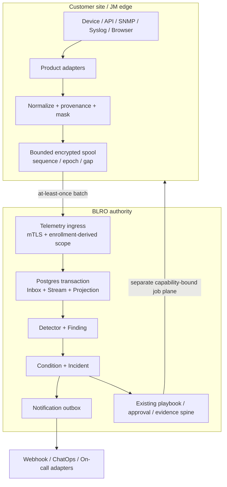
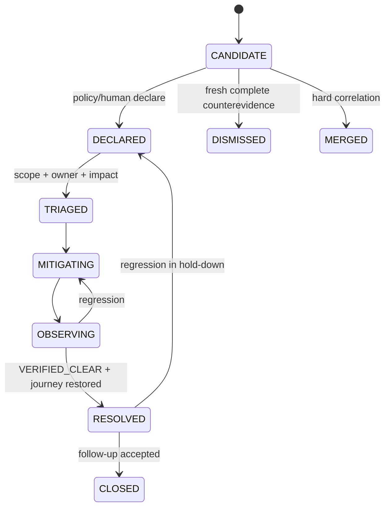
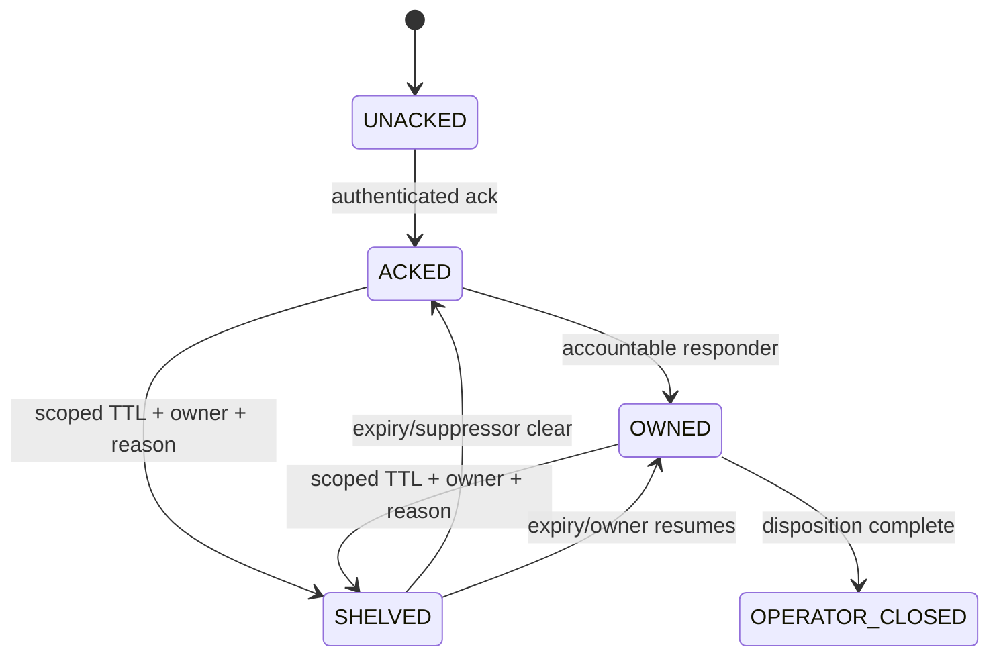
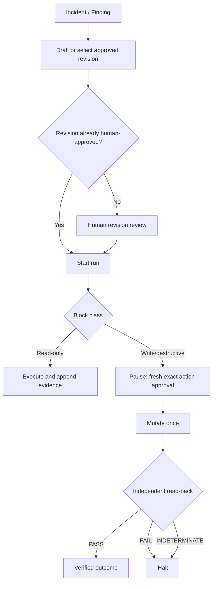

# 제품별 실시간 모니터링·탐지·1차 대응 플랫폼 기획 조사

**Status:** **DRAFT**
**Research date:** 2026-08-17
**Repository baseline:** `9fdf098`
**Scope:** Sangfor HCI/SCP, IAG/Athena SWG, Endpoint Secure/Athena EPP,
Cyber Command/Athena NDR, FortiOS, Cisco IOS-XE
**Decision owner:** product, architecture, security, field engineering 공동 검토

> 이 문서에서 **MEASURED**는 저장소 실행 결과나 1차 자료로 확인한 사실,
> **DERIVED**는 그 사실에서 도출한 설계 결정, **ASSUMED**는 파일럿에서 검증해야 할
> 초기 목표를 뜻한다. 수치 앞에 이 표기가 없으면 생산 기준으로 사용하면 안 된다.

**목차:** [1. 경영진 요약](#1-경영진-요약) ·
[2. 제품 정의와 비타협 원칙](#2-제품-정의와-비타협-원칙) ·
[3. 현재 역량과 갭](#3-현재-역량과-갭) ·
[4. 제품별 수집·연동 전략](#4-제품별-수집연동-전략) ·
[5. 목표 JM-BLRO 실시간 아키텍처](#5-목표-jm-blro-실시간-아키텍처) ·
[6. Canonical contracts](#6-canonical-contracts) ·
[7. 탐지·분류·사건·RCA 모델](#7-탐지분류사건rca-모델) ·
[8. 1차 대응 정책과 runbook 경계](#8-1차-대응-정책과-runbook-경계) ·
[9. 제품 엔지니어 운영 경험](#9-제품-엔지니어-운영-경험) ·
[10. Build-vs-integrate와 단계별 로드맵](#10-build-vs-integrate와-단계별-로드맵) ·
[11. 지표와 합격 게이트](#11-지표와-합격-게이트) ·
[12. 리스크·결정·출처](#12-리스크-결정-로그-미해결-질문-출처)

---

## 1. 경영진 요약

### 1.1 결론

현재 저장소는 **연속 운영 루프가 아니라, 무결성 중심의 안전·증거 기반 토대**다.
이미 재사용할 가치가 큰 구성 요소는 다음과 같다.

- `PASS / FAIL / INDETERMINATE`를 보존하는 spec 평가
- action-bound, short-lived, single-use 승인과 nonce
- 독립 read-back이 있어야만 성공으로 인정하는 실행 경로
- append-only run/audit/evidence와 비밀 마스킹
- 승인된 immutable playbook revision과 write block의 human pause
- JM 원격 실행을 위한 mTLS/capability/replay 방어 라이브러리
- cursor/ledger를 가진 결정적 tick kernel

반면, 사용자가 원하는 `observe -> detect -> triage -> respond -> verify` 운영 제품에는
다음 핵심 계층이 없다.

1. 제품별 수집기를 지속 실행하는 scheduler/lease/heartbeat
2. freshness-aware `ObservationEvent`와 `Finding`
3. 기술 상태와 사람 업무 상태를 분리한 incident aggregate
4. correlation, suppression, escalation, notification outbox
5. BLRO authority store와 JM endpoint를 실제 서비스로 조립하는 application ports
6. 사건 중심 Work Queue, timeline, handoff, delivery-health UX

따라서 제품 방향은 **기존 안전 기반을 유지한 채 관측·사건 운영 계층을 새로
구축하는 것**이다. 현재 상태를 “실시간 폐쇄 루프”라고 부르면 안 된다.

### 1.2 권고안

- **아키텍처:** JM에서 제품별 관측·마스킹·durable spool을 수행하고,
  BLRO가 authenticated at-least-once batch를 받아 canonical history와 derived state를
  소유한다.
- **저장소:** MVP는 Postgres의 `Inbox / Stream / Projection`과 incident/outbox
  aggregate로 시작한다. Kafka/JetStream은 측정된 병목이나 다중 durable consumer가
  생길 때만 추가한다.
- **탐지:** freshness, source health, provenance, product/version을 먼저 판정한 뒤
  deterministic rule/spec를 평가한다. ML은 이후다.
- **Incident:** 하나의 `status`가 아니라 machine condition, incident workflow,
  operator disposition의 세 상태 기계를 사용한다.
- **Response:** 자동화는 read-only enrichment와 플랫폼 실행 권한 축소까지만 허용한다.
  생산 장비 변경은 매번 새로운 human approval과 독립 read-back을 요구한다.
- **Rollout:** Stage 0 정확성 결함을 먼저 고친 후 HCI shadow -> queue-only ->
  business-hours notification -> primary route 순으로 진입한다. IAG, EPP, NDR은
  각자 readiness gate를 통과해야 한다.

### 1.3 출시 전 P0 차단 항목

| P0 | 현재 증거 | 필요한 완료 조건 |
|---|---|---|
| `[C054]` 오래된 observation이 PASS 가능 | `[S067]` `tests/spec-provenance.test.ts:33-38` | 평가 전에 freshness/coverage gate를 적용하고, 건강 평가는 INDETERMINATE·condition은 UNKNOWN 처리 |
| `[C055]` 빈 HCI inventory가 healthy | `[S067]` `packages/sangfor-hci-client/src/ops-monitor.ts:29`, `tests/hci-ops-monitor.test.ts:28-32` | empty/partial/auth-scope-loss를 각각 판정하고 건강 평가는 INDETERMINATE 처리 |
| `[C013]` BLRO store가 app에 조립되지 않음 | `[S015,S018]` `packages/sangfor-authority/src/index.ts`, `apps/control-tower/src/api.ts` | authority application adapter와 cutover test |
| `[C012]` JM server가 배포 가능한 서비스가 아님 | `[S017]` `packages/sangfor-browser-contracts/src/remote-server.ts` | endpoint daemon, durable idempotency, verifier, evidence ACK |
| `[C009,C011]` 사건·알림·scheduler가 없음 | `[S013,S016]` `apps/control-tower/src/api.ts`, `package.json:22` | canonical contracts, incident store, leases, outbox |
| `[C056]` approver identity가 자유 입력 | `[S067]` `apps/control-tower/src/ui.ts:518-527` | server-derived actor와 RBAC/CAS |
| `[C048]` HCI delete가 202를 성공 취급 | `[S065]` HCI delete handler/read-back 비교 | 독립 absence read-back 전까지 reversible claim 금지 |
| `[C060]` 생산 multi-tenancy 미증명 | `[S071,S072]` JM `mcp-local` 기본값과 미구현 telemetry aggregate | ingestion부터 backup/restore까지 cross-tenant 시험 |

---

## 2. 제품 정의와 비타협 원칙

### 2.1 제품 정의

이 제품은 “모든 장비를 자동으로 고치는 AI”가 아니다. 제품 엔지니어가 여러 제품의
상태를 한 큐에서 보고, 신뢰할 수 있는 증거를 바탕으로 사건을 선언·분류하고,
가장 안전한 다음 조치를 실행하거나 사람에게 넘기는 **field-engineer workbench**다.

`real-time`은 마케팅 수사가 아니라 source별 계약이다.

```text
occurrence -> JM observe -> BLRO commit -> rule decision
           -> operator-visible -> human acknowledge
```

각 단계에 enforced budget, heartbeat, freshness deadline, gap accounting이 없으면
그 source는 `periodic`, `best-effort`, 또는 `attended snapshot`으로 표시한다.
브라우저 로그인, CAPTCHA, VPN, 수동 탐색이 필요한 경로는 생산 critical detection의
실시간 source로 분류하지 않는다.

### 2.2 비타협 원칙

1. **UNKNOWN은 PASS가 아니다.** stale, missing, blind, partial, schema mismatch,
   ambiguous identity는 모두 현재 건강을 증명하지 못한다.
2. **2xx는 성공이 아니다.** mutation 성공은 독립 read-back `PASS`만 인정한다.
3. **침묵은 복구가 아니다.** source가 사라지면 마지막 green을 유지하지 않고
   `UNKNOWN/STALE`로 전이한다.
4. **승인은 진실이 아니다.** 승인은 실행 권한일 뿐 진단의 인과성이나 복구를
   증명하지 않는다.
5. **사건은 승인을 만들지 않는다.** incident는 draft를 만들거나 이미 승인된
   revision을 시작할 수 있지만 revision/action을 스스로 승인할 수 없다.
6. **자동 rollback은 없다.** reverse action도 별도 계획·승인·검증이 필요한 새 action이다.
7. **보안 제품 write는 human-only다.** IAG, EPP, Cyber Command/NDR device mutation은
   시스템이 증거·절차를 준비하고 사후 검증할 수 있지만 자동 실행하지 않는다.
8. **한 aggregate에는 한 authoritative writer만 둔다.**
9. **telemetry credential은 approval credential이 아니다.**
10. **확인되지 않은 vendor capability를 만들지 않는다.**

### 2.3 현재 주장 가능한 표현

- “Evidence-first, fail-closed operational automation primitives”
- “Human-gated, read-back-verified response workflow foundation”
- “Deterministic knowledge-quality loop kernel”
- “Secure BLRO-to-JM remote-execution protocol foundation”
- “Multi-vendor read-only sweep and advisory console”

현재 금지할 표현:

- “continuous multi-product monitoring”
- “real-time incident detection”
- “closed-loop self-healing”
- “AI root cause found”
- “autonomous remediation”
- “operational BLRO authority service”
- “deployable JM endpoint service”

---

## 3. 현재 역량과 갭

### 3.1 Reuse / Extend / Build

| 영역 | REUSE | EXTEND | BUILD |
|---|---|---|---|
| 관측 | bounded CDP observer, HCI inventory, vendor sweep | recurring policy, delta, freshness, device identity | durable stream, heartbeat, subscriber |
| 탐지 | `evaluateSpec`, audit gap, HCI read-back | normalized Finding, rule version, dedupe | rate/anomaly/topology detectors |
| 사건 | RCA candidate, analysis/task records | evidence linkage, owner, scope | incident lifecycle, SLA, correlation |
| 대응 | approved playbook, action approval, read-back | incident binding, response outcome | policy-controlled orchestrator |
| 실행 | HCI create, guarded browser action | cross-vendor verifier/state contract | supported product action adapters |
| 증거 | hash chain, capture verification, reports | central lineage/manifest, upload ACK | JM-to-BLRO object transfer |
| scheduler | tick lock/cursor/ledger | lease, heartbeat, backfill | production scheduler/worker |
| Control Tower | registry, runs, sweeps, playbooks | incident/work queue/read models | notification and case UX |
| Authority | RLS store, remote transport primitives | app composition, durable replay | JM daemon and telemetry ingress |

### 3.2 현재 operations loop가 아닌 이유

`packages/sangfor-loop`는 재사용 가능한 cursor/ledger kernel이지만 committed graph는
search gap, embedding drift, planner regression 등 knowledge-quality에 한정된다.
`scripts/loop-tick.ts`의 collection edge는 “dispatchable”을 보고할 뿐 실제
`learn:sources`를 실행하지 않는다. 저장소 안에는 tick을 계속 호출하는 cron,
launchd, CI, service가 없다. Control Tower sweep 역시 수동 read-only 호출이다.

따라서 정확한 표현은 다음과 같다.

> 이 저장소에는 운영 폐쇄 루프를 만들 수 있는 안전·증거 부품과 좁은
> knowledge-quality tick loop가 있다. telemetry -> incident -> notification ->
> gated response로 이어지는 운영 루프는 없다.

### 3.3 계약 부재

P0 계약:

- `ObservationEvent.v1`
- `Finding.v1`
- `ConditionOccurrence.v1`
- `OperatorCase/Incident.v1`
- `ResponseExecution.v1`
- `LoopSchedule/Lease.v1`
- BLRO authority application ports와 JM server bootstrap

P1 계약:

- `AlertPolicy`와 `NotificationDelivery`
- `AgentTaskLease/Result`
- `EvidenceManifest.v1`
- `CapabilityCoverage/Freshness`
- authoritative-store cutover/migration checkpoint

### 3.4 현재 강점의 한계

HCI health는 point-in-time volume/inventory summary이지 cluster baseline이나 사건
모니터가 아니다. FortiOS/Cisco advisor는 실제 read path를 갖지만 지속 scheduler와
event completeness는 없다. EPP/CC는 captured XHR과 CDP evidence가 중심이고,
IAG mapper는 없다. spec 파일이 존재하는 것과 observation producer가 존재하는 것은
다르다. 운영 coverage는 **field-verified product × version × signal**만 계산해야 한다.

---

## 4. 제품별 수집·연동 전략

Latency class:

- `STREAM`: event/stream, 통상 초 단위 목표
- `POLL`: pull, 초~분 단위
- `BATCH`: scheduled export
- `SNAPSHOT`: 수동/attended UI capture

아래는 지원 가능성을 과장하지 않은 우선순위다. 대괄호는 claim/source 원장 ID다.

#### HCI `[C019][S025,S043,S044]`

- **확인:** SNMP v1/v2c/v3, traps, syslog. 공식 HCI API 안내는 SCP/HCI REST
  OpenAPI 문서를 가리킨다.
- **후보:** SNMP/syslog `STREAM/POLL`; REST는 exact release 계약 확인 전 후보.
- **한계·gate:** HCI telemetry-specific API인지, 저장소 OpenStack endpoint와
  동일·호환되는지 미확인. exact API catalog, pagination, trap MIB/source,
  all-node TCP syslog, empty/partial 판정을 lab에서 증명한다.

#### SCP `[C019][S043,S053]`

- **확인:** version-pinned SCP 6.7 token REST와 별도의 later HCI/SCP REST OpenAPI
  overview.
- **후보:** credential POST 후 token을 쓰는 `POLL`.
- **한계·gate:** token TTL/RBAC와 deployed-version catalog가 불명확하다. TLS/RBAC/TTL,
  scope, resource coverage를 lab에서 고정한다.

#### IAG/Athena SWG `[C020,C040][S026,S045,S054]`

- **확인:** version-pinned Public REST API 후보, LDAP API, SNMP traps, syslog,
  FTP export.
- **후보:** REST/SNMP/syslog `POLL/STREAM`; FTP `BATCH`.
- **한계·gate:** public endpoint schema/auth를 확인하지 못했다. target API guide,
  v3 cipher/OID, syslog framing/TLS, export heartbeat를 증명한다.

#### Endpoint Secure/EPP `[C021,C040][S027,S046,S055]`

- **확인:** security events/logs, version-pinned Data Sync JSON syslog,
  CDP/XHR capture.
- **후보:** syslog `STREAM`; browser `SNAPSHOT`.
- **한계·gate:** public REST/webhook은 미확인이고 SaaS Data Sync는 backend
  enablement가 필요할 수 있다. framing/size/schema, loss heartbeat, tenant
  credential을 lab에서 검증한다.

#### Cyber Command/NDR `[C024][S047,S056-S058]`

- **확인:** 3.0.60 REST datasets와 3.0.50c syslog. vSTA는 Cyber Command 자체의
  SPAN sensor input이다.
- **후보:** BLRO 수집 경로는 REST `POLL`과 syslog `STREAM`; vSTA는 BLRO
  connector가 아니다.
- **한계·gate:** query token 노출, 5k/10k dataset limit, newer Athena NDR
  compatibility를 검증한다.

#### FortiOS `[C008,C023][S011,S031]`

- **확인:** REST API admin과 SNMP read-only/traps.
- **후보:** least-privilege token, trusted hosts, optional client cert를 쓰는
  `POLL/STREAM`.
- **한계·gate:** full API catalog는 FNDN gate다. VDOM/firmware endpoint와 MIB를
  검증한다. syslog/webhook은 source 원장과 lab 계약이 추가되기 전에는 지원 후보가 아니다.

#### Cisco IOS-XE `[C022][S028-S030]`

- **확인:** RESTCONF, gNMI, MDT. NETCONF, SNMP, syslog는 target image별로
  별도 확인한다.
- **후보:** YANG/AAA/TLS; gNMI/MDT `STREAM`, RESTCONF `POLL`.
- **한계·gate:** 17.15 RESTCONF event stream 제약과 platform별 subscription,
  encoding, YANG deviation, replay를 검증한다.

### 4.1 수집 방식 선택 순서

1. 지원되는 native event/stream
2. 지원되는 read-only API polling
3. SNMP trap + query
4. syslog/export
5. local agent/collector
6. version-pinned browser observation
7. attended export/manual capture

push event는 complete state가 아니라 **latency hint**로 취급한다. push를 수신하면
debounced read-only reconciliation을 수행하고, 주기적 full snapshot으로 누락을
복구한다. partial snapshot은 absent entity를 tombstone하거나 current baseline을
증명할 수 없다.

### 4.2 제품 onboarding gate

제품과 firmware마다 다음을 증명해야 한다.

- stable resource ID와 tenant/device attribution
- auth lifecycle와 최소 권한
- schema/version negotiation
- complete pagination 또는 명시적 partial
- event time, observation time, clock uncertainty
- source heartbeat와 gap accounting
- duplicate/order/reconnect behavior
- field fixture와 independent ground truth
- owner/runbook와 alert budget

UI/XHR만 확인되고 replay/reconciliation이 없으면 `attended snapshot`으로만 출시한다.

---

## 5. 목표 JM-BLRO 실시간 아키텍처

### 5.1 권고 topology `[C042,C045,C057]`



JM은 local browser session, transient credential, local execution/observation fact와
BLRO가 아직 ACK하지 않은 evidence byte에 대해서만 **ACK 전 임시·로컬 권위**를
가진다. durable ACK 이후 canonical history와 모든 derived/current state의 유일한
권위는 BLRO다.

### 5.2 Event/ACK semantics

`jm-telemetry-event.v1` 핵심 필드:

```text
eventId, eventType, source, subject,
edgeId, enrollmentId, streamId, producerEpoch, sequence,
occurredAt?, observedAt, timeQuality,
payloadHash, typedPayload,
traceparent?, runId?, stepId?, causationEventId?
```

tenant/project는 payload 값을 신뢰하지 않고 enrollment에서 도출한다. approval token,
nonce, cookie, authorization header, CDP endpoint, local path는 schema에서 금지한다.

ACK는 Postgres transaction이 inbox insert와 projection update를 함께 commit한 뒤에만
보낸다. 이 ACK는 **telemetry event ACK**다. evidence byte는 별도의
`EvidenceManifest` upload/verify ACK 전까지 JM spool에서 삭제하지 않는다. ACK가
유실되면 같은 batch가 재전송된다.

- same identity + same hash: duplicate success
- same identity + different hash: quarantine와 integrity incident
- out-of-order: inbox에는 저장하되 contiguous watermark 전에는 current projection 금지
- explicit gap: projection은 `DEGRADED`
- writer takeover: BLRO가 epoch를 증가시키고 old epoch는 current state를 전진시킬 수 없음
- replayed backlog: 새 full snapshot 전에는 `FRESH`가 아님

### 5.3 Freshness와 backpressure

세 시간축을 저장한다.

- vendor `occurredAt`
- JM `observedAt`
- BLRO `ingestedAt`

edge spool은 network 전송 전 mask/canonicalize/fsync하고, contiguous durable ACK 이후에만
삭제한다. quota 초과로 손실이 불가피하면 `stream.gap.v1`을 기록한다. backlog drain
중에도 heartbeat와 current full snapshot 공간을 예약한다.

JM spool과 batch는 enrollment에서 도출한 tenant/project/device scope로 분리하고,
ingress가 canonical scope를 다시 도출한다. caller-supplied scope는 권위가 없다.

### 5.4 OTel과 broker 결정 `[C043,C044]`

OpenTelemetry는 pipeline 자체의 logs, metrics, traces에 사용한다. domain event,
tenant authority, ordering, approval, final verdict의 system of record로 사용하지 않는다.

broker는 다음 중 하나가 측정될 때까지 넣지 않는다. 아래 개수 기준은
**DERIVED** architecture trigger다.

- 독립적인 durable replay consumer가 두 개 이상 필요
- batched/partitioned Postgres가 sustained burst를 감당하지 못함
- cross-region buffering이 필요
- inbox retention보다 긴 replay가 필요

| Option | 현재 결론 |
|---|---|
| BLRO가 device를 직접 poll | customer-local browser/credential에 맞지 않아 기본안으로 거부 |
| JM -> broker -> BLRO | burst/replay/fan-out은 좋지만 운영 면적이 늘어나 measured trigger 전 보류 |
| OTel agent/gateway | pipeline observability에 사용하되 canonical authority로는 거부 |
| JM -> BLRO Postgres inbox | **권고:** 현재 authority split에 맞는 가장 작은 설계 |

### 5.5 Failure acceptance suite

1. commit 후 ACK 유실: projection은 한 번만 변한다.
2. same ID/different hash: overwrite 없이 quarantine한다.
3. sequence 5가 4보다 먼저 도착: watermark는 3에서 대기한다.
4. JM +10분/device -5분: timestamp로 order를 만들지 않는다.
5. 하루 전 backlog replay: current full snapshot 전에는 fresh가 아니다.
6. heartbeat는 살고 poll은 실패: source는 stale다.
7. 두 JM writer: 새 epoch만 current를 전진시킨다.
8. offline quota 초과: silent loss가 아니라 explicit gap이다.
9. tenant A enrollment이 project B를 주장: insert 전에 batch 전체를 거부한다.
10. telemetry가 approval material을 포함: schema reject한다.

---

## 6. Canonical contracts

### 6.1 핵심 aggregate

| Contract | 책임 |
|---|---|
| `ObservationEvent.v1` | immutable source fact, scope, provenance, freshness, evidence refs |
| `Finding.v1` | versioned detector assertion, tri-state verdict, certainty, dedupe |
| `ConditionOccurrence.v1` | machine truth와 generation |
| `Incident.v1` | linked findings, workflow, owner, impact, urgency, timeline |
| `OperatorDisposition.v1` | ack, ownership, shelf TTL, handoff |
| `ResponseExecution.v1` | action hash, approval, precondition, read-back, evidence |
| `EvidenceManifest.v1` | lineage, hashes, ACL, retention, upload/verify state |
| `LoopScheduleLease.v1` | cadence, lease, heartbeat, cursor, backfill, retry, DLQ |
| `NotificationIntent.v1` | occurrence/attention/revision fence, frozen payload, dedupe |
| `DeliveryAttempt.v1` | lease, attempt, receipt, unknown outcome, DLQ |

공통 불변식은 immutable ID, tenant scope, schema/version, three timestamps와
provenance다. `ConditionOccurrence.v1`의 상태는 아래 machine condition diagram이
정의하고, incident workflow와 operator disposition은 서로 다른 aggregate로 유지한다.

### 6.2 Observation completeness

모든 observation은 다음을 선언한다.

- `completeness`: `full | partial | delta | attended`
- `freshness`: `fresh | late | stale | missing | blind | quarantined`
- `lineageGroup`: 독립 corroboration 계산용
- `sourceHealth`: collector와 device source를 분리
- `validUntil`과 `expectedNextBy`
- `schemaVersion`, `productVersion`, `collectorVersion`

`full`만 absent entity와 complete healthy baseline을 주장할 수 있다.

### 6.3 Notification fencing

`NotificationIntent`는 incident event와 같은 transaction에서 outbox된다. external
provider의 2xx는 `accepted`일 뿐 human ACK가 아니다. 사람 ACK는 다음 fence를 가진
authenticated command다.

```text
tenantId, projectId, incidentOccurrenceId,
attentionEpoch, expectedRevision, policyVersion, actorId
```

severity 증가나 recurrence는 새로운 attention epoch를 만들며 재-ACK가 필요하다.

---

## 7. 탐지·분류·사건·RCA 모델

### 7.1 세 개의 직교 상태 기계

#### Machine condition

```mermaid
stateDiagram-v2
accTitle: Machine condition 상태 기계
accDescr: 관측 완전성과 검증 결과에 따라 UNKNOWN, HEALTHY, ACTIVE, RECOVERING, VERIFIED_CLEAR 사이를 전이한다.
  [*] --> UNKNOWN
  UNKNOWN --> HEALTHY: fresh healthy evidence + coverage
  UNKNOWN --> ACTIVE: fresh failure evidence
  HEALTHY --> ACTIVE: fire predicate
  ACTIVE --> RECOVERING: fresh clear trend or mitigation
  RECOVERING --> ACTIVE: regression/read-back fail
  RECOVERING --> VERIFIED_CLEAR: clear + read-back + hold-down
  VERIFIED_CLEAR --> ACTIVE: recurrence
  HEALTHY --> UNKNOWN: telemetry expires
  ACTIVE --> UNKNOWN: telemetry expires; last_confirmed=ACTIVE
```



#### Incident workflow



#### Operator disposition



ACK, OWN, SHELVE, OPERATOR_CLOSED는 machine condition을 바꾸지 않는다. 이는 RFC 8632의
resource alarm lifecycle과 operator lifecycle 분리를 따른다.
`VERIFIED_CLEAR`는 특정 incident occurrence의 clear 검증 완료이고, `HEALTHY`는
open occurrence가 없는 평시 baseline이다. `CLOSED` 이후 recurrence는 기존 record를
재개하거나 전이하지 않는다. 외부 recurrence event가 별도의 `CANDIDATE` occurrence를
생성하고 `recurrence_of`로 닫힌 occurrence와 연결한다.

### 7.2 Evidence graph correlation

incident는 opaque cluster가 아니라 typed evidence graph다.

- `HARD`: same trace/request, explicit parent, immutable change transaction
- `STRONG`: exact entity, direct dependency, matching blast radius/cohort
- `SUPPORTING`: plausible sequence, compatible symptom, recurrence signature
- `VETO`: tenant conflict, incompatible UID, impossible time order, unreachable topology,
  distinct failure domain

**DERIVED:** HARD + no veto, 또는 독립 STRONG 두 축 이상일 때만 attach한다.
timestamp/text 유사성은
`RELATED_CANDIDATE`까지만 허용한다. 한 signal은 한 primary incident에 속하지만
alternate hypothesis edge를 보존할 수 있다.

### 7.3 Certainty, freshness, severity, urgency

certainty는 incident 전체가 아니라 `condition exists`, `scope`, `impact`,
`membership`, 각 RCA hypothesis에 붙는다.

```text
label = OBSERVED | LIKELY | POSSIBLE | UNLIKELY | UNKNOWN | CONTESTED
calibratedInterval = [pL, pU] | null
supportingEvidenceIds[]
contradictingEvidenceIds[]
independentLineageGroups[]
coverage, asOf, ruleVersion
```

backtest되지 않았다면 숫자 probability를 만들지 않는다. fresh support와 fresh
refutation이 남으면 `CONTESTED`로 보존하고 discriminating probe와 deadline을 만든다.
failure와 healthy를 평균내어 “medium”으로 만들지 않는다.

severity는 harm, urgency는 time-to-harm, certainty는 evidence quality, route는 필요한
coordination이다. 네 축을 한 priority 숫자로 덮지 않는다.

### 7.4 Cost-sensitive escalation

route `a`에 대해:

- `H(I,U)`: 사람이 개입하지 않을 때의 harm
- `r(a)`: route가 회피할 수 있는 harm 비율
- `F(a)`: interruption/mobilization cost와 action risk

```text
p * r(a) * H(I,U) >= F(a)
```

`[pL,pU]`가 보정되어 있다면:

- `pL*rH >= F`: robustly escalate
- `pU*rH < F`이고 검증이 harm 전에 끝남: async/watch
- threshold를 가로지름: `DECISION_UNCERTAIN`, discriminating probe
- harm이 irreversible하거나 probe+mobilization보다 빠름: worst-regret human route

이 식은 자동 실행 규칙이 아니라 설명 가능한 human-routing 정책이다.

### 7.5 Dedup, suppression, storm

구분해야 할 여섯 계층:

1. exact ingest dedup
2. entity/predicate temporal coalescing
3. incident grouping
4. confirmed upstream inhibition
5. scoped silence/maintenance
6. flap/rate control

suppression은 notification만 줄이고 signal/condition을 삭제하거나 clear하지 않는다.
모든 suppression은 scope, owner, reason, start, expiry, suppressor freshness를 가진다.
parent가 clear되면 child를 즉시 재평가한다. severity, scope, required action의 material
delta는 rate cap을 우회한다.

### 7.6 RCA는 “확정 원인”이 아니라 경쟁 hypothesis

RCA candidate는 mechanism, causal path, time interval, affected/unaffected cohort,
support/refutation lineage, intervention result, 다음 probe를 저장한다.

순위:

1. mechanism-specific direct evidence
2. intervention + read-back
3. causal topology
4. affected/unaffected scope contrast
5. temporal precedence
6. independent corroboration
7. recurrence prior
8. coincident change/text similarity

상태는 `HYPOTHESIS / PLAUSIBLE / LEADING / CONFIRMED / CONTRIBUTING / REFUTED /
UNRESOLVED`다. `CONFIRMED`는 mechanism과 successful intervention/read-back 또는
deterministic causal trace가 있고 주요 대안이 반박될 때만 사용한다. UI 문구는
“root cause found”가 아니라 “ranked hypotheses and checks”다.

### 7.7 Paper stress-test

| Scenario | 합격 행동 |
|---|---|
| 20,000 false-positive storm + 실제 outlier | 한 observability page와 bounded summary, independent outlier는 즉시 page |
| mitigation 후 telemetry loss | `UNKNOWN + last_confirmed=ACTIVE`, incident는 OBSERVING 유지 |
| fresh contradictory signals | assertion/scope를 정규화하고 CONTESTED + probe |
| recurring incident | hold-down 내 regression은 같은 episode, closure 이후는 linked new episode |
| concurrent changes | nearest deploy 금지, mechanism/path/contrast/intervention으로 순위 |

---

## 8. 1차 대응 정책과 runbook 경계

### 8.1 다섯 response class

| Class | 허용 범위 | 현재 eligibility |
|---|---|---|
| R0 automatic read-only enrichment | 수집, 상관, 평가, evidence, read-only probe | 가능 |
| R1 automatic safe containment | 플랫폼의 실행 권한 deny/revoke/quarantine만 | 일부 policy 설계, target-scoped 구현 필요 |
| R2 pre-approved reversible action | bounded window의 exact single-use capability | 미래 lab 후보, 현재 생산 불가 |
| R3 explicit approval-required action | incident 시점의 exact human approval | HCI 일부 mock 경로만 |
| R4 human-only action | 시스템은 절차·증거·사후 검증만 | IAG/EPP/NDR write, destructive/ambiguous action |

R1은 customer device를 바꾸는 containment가 아니다. 추가 mutation을 막는
platform-authority reduction이다.

### 8.2 Incident-to-playbook 불변식



- revision approval과 action approval은 별도다.
- incident-specific target/tool/args 변경은 새 draft다.
- approval은 tenant/device/occurrence generation/action/args/expected read-back/expiry에 bind한다.
- 실행 직전 observation이 premise를 무효화하면 approval은 만료된다.
- missing `changeTicketId`/`rollbackPlanId` default는 incident path에서 허용하지 않는다.
- disconnect after possible mutation은 INDETERMINATE이며 자동 retry하지 않는다.
- HCI delete는 독립 absence read-back이 필요하며 결과가 불확실하면 재시도하지 않는다.

### 8.3 제품별 1차 대응

- **HCI/SCP:** R0 inventory/health/read-back. R2/R3는 lab에서 action별로 검증한다.
  delete는 absence read-back 전까지 reversible로 취급하지 않는다.
- **IAG:** auth/access/log evidence를 R0로 수집한다. policy/auth/HA/firmware 변경은 R4다.
- **EPP:** detection, agent health, event evidence는 R0다. isolate/quarantine/deploy/policy는 R4다.
- **Cyber Command/NDR:** incident/event-source/SOAR evidence는 R0다. downstream
  block/isolation/allowlist/SOAR mutation은 R4다.
- **FortiOS/IOS-XE:** 이번 scope에서는 read-only observation/advisory만 출시한다.

### 8.4 자동 remediation 제외 이유

authorization, idempotency, config equality는 causal correctness, downstream service recovery,
unchanged precondition, bounded blast radius를 증명하지 않는다. 현재는 distributed fencing,
topology/quorum protection, canary budget, kill switch, action별 real-device evidence가 없다.
따라서 autonomous production remediation은 명시적으로 out of scope다.

---

## 9. 제품 엔지니어 운영 경험

### 9.1 Information architecture

기본 landing은 dashboard가 아니라 attention-ranked **Work Queue**다.

1. Work Queue
2. Incidents
3. Engagements
4. Changes/Approvals
5. Evidence & Reports
6. Knowledge
7. Fleet & Integrations
8. Policy/Admin

global context bar는 tenant/customer -> project -> site/device, actor/on-call role,
lab/production, read-only/write-gate, system/delivery degradation을 계속 보존한다.

### 9.2 Incident workspace

한 화면에서 답해야 하는 질문:

- 무엇이 바뀌었는가?
- 무엇이 영향을 받는가?
- telemetry는 얼마나 fresh하고 trustworthy한가?
- 어떤 증거가 있는가?
- 누가 소유하는가?
- 다음 deadline은 무엇인가?
- 지금 가능한 가장 안전한 행동은 무엇인가?

header에는 condition, freshness, workflow, owner/ack, attention epoch, age, escalation을
별도 badge로 표시한다. evidence timeline과 operator activity timeline은 동기화하되
필터를 분리한다.

### 9.3 Queue와 topology

queue row는 severity, current/peak impact, owner, deadline, source, evidence state,
last meaningful progress, next safe action을 보여준다. live update는 storm 중 pause할 수
있지만 paused/stale 상태를 명시한다.

topology는 거대한 graph부터 시작하지 않는다. active incident burden으로 hotspot을
정렬하고, node에서 open incidents, dependency direction, on-call owner, filtered queue로
drill down한다. “no open incidents”를 “healthy”로 번역하지 않는다.

### 9.4 Approval과 handoff

approval pane은 exact target, action/diff, risk, evidence age, expiry, expected read-back,
reversibility를 보여준다. `approvedBy`는 server-derived identity다.

handoff는 `requested -> accepted | rejected | revoked | expired`의 two-party custody다.
recipient가 CAS로 accept하기 전까지 기존 owner가 책임진다. message delivery는
handoff acceptance가 아니다.

### 9.5 Notification plane

첫 adapter는 signed webhook, 두 번째는 하나의 ChatOps channel이다. email/mobile은
같은 redacted envelope와 authenticated deep-link command를 재사용한다.

- provider 2xx: transport accepted
- delivered/open/tap: human ack 아님
- explicit authenticated command: ack/claim/handoff acceptance
- post-send crash: `UNKNOWN_OUTCOME`
- resolution 중 in-flight: `superseded`, recall 성공을 주장하지 않음
- all routes down: local latched banner와 독립 break-glass monitoring

### 9.6 Storm UX

storm banner는 ingress rate, unique incidents, exact replay, coalesced/suppressed count,
affected assets, DLQ/UNKNOWN_OUTCOME, degraded routes, remaining critical budget을 표시한다.
bulk ack는 명시적으로 선택한 same-correlation group만 허용하고 MVP에는 bulk resolve를
넣지 않는다.

---

## 10. Build-vs-integrate와 단계별 로드맵

### 10.1 Build-vs-integrate

| Capability | 결정 |
|---|---|
| domain event/finding/incident/evidence contract | Build |
| product connectors | Build thin versioned adapters |
| OTel collector/metrics backend | Integrate |
| TSDB | Integrate, BLRO에는 incident-relevant facts만 |
| deterministic detection/correlation/suppression | Build |
| incident queue/timelines | Build |
| transactional outbox/receipt model | Build |
| SMS/voice/mobile transport | Integrate |
| on-call schedules/escalation | Integrate via replaceable adapter |
| playbook/approval/evidence execution spine | Extend existing |
| autonomous production mutation | Do not build |

### 10.2 Readiness-gated phases

| Stage | Gate |
|---|---|
| 0 Correctness & authority `[C054-C060]` | false-green 0, restart/replay/cutover/isolation |
| 1 HCI shadow `[C019,C055]` | exact version, completeness/gap, no stale healthy |
| 2 HCI queue-only `[C014-C017]` | deterministic replay, no duplicate transition |
| 3 HCI business-hours `[C050-C053]` | no lost outbox, explicit ack, noise gate |
| 4 HCI primary route `[C058]` | drill, source-specific delivery SLO, operator sign-off |
| 5 IAG read-only `[C020,C040]` | schema/auth/heartbeat/unknown gate |
| 6 EPP observation `[C021,C040]` | delivery schema, dedupe, no action write |
| 7 Cyber Command/NDR `[C024]` | versioned REST/syslog, no recursive storm |
| 8 Multivendor read-only `[C022,C023]` | negotiated feature matrix, writer fencing |
| 9 Future reversible lab eligibility `[C046,C048,C061]` | ticket/rollback ID, absence/read-back, uncertainty 시 no-retry |

Stage 0은 이후 신뢰성의 기반이고, Stage 1은 ground truth를 측정한다. Stage 2는
point-in-time report를 durable work queue로 바꾸며, Stage 3~4는 실제 engineer
mobilization과 운영 가능한 첫 제품을 검증한다. Stage 5~8은 각 제품의 read-only
incident ownership을 넓힌다. Stage 9는 현재 capability가 아니라 future eligibility다.

signal onboarding과 action automation은 서로 다른 rollout이다. 한 제품의 read-only
monitoring이 승인됐다고 write가 승인되는 것은 아니다.

### 10.3 Rollout mechanics

1. Shadow
2. Queue-only
3. Business-hours notification
4. Primary on-call route
5. Automatic read-only enrichment
6. Individually approved lab action

### 10.4 초기 staffing 가정

**ASSUMED:** 기존 safety/evidence spine을 재사용할 수 있다는 전제에서 12~16주 동안
6~8명 규모의 MVP 전담 팀이 필요하다.

- technical lead/domain architect 1
- backend/platform 2
- connector 2
- console/frontend 1
- SRE/security 0.5~1
- product/operations lead 0.5와 named pilot operators

이는 사실이 아니라 예산·일정 수립을 위한 가정이며, vendor contract와 customer
network access 지연을 포함하지 않는다.

---

## 11. 지표와 합격 게이트

### 11.1 운영 지표

| Domain | Metric | 목적 |
|---|---|---|
| Source health | fresh-source ratio, last observation age, gap duration | silent collector 탐지 |
| Integrity | duplicate, hash conflict, schema reject, out-of-order, attribution | connector 품질 |
| Detection | drill recall, operator precision, flap/reopen | policy 조정 |
| Noise | pages/shift, actionable ratio, grouped signals/page | primary route gate |
| Incident | detect/assign/ack/mitigate/clear/close time | machine/human milestone 분리 |
| Delivery | outbox age, attempt, acceptance, callback, UNKNOWN_OUTCOME, DLQ | adapter 운영 |
| Response | recommendation acceptance, approval latency, PASS/FAIL/INDETERMINATE | 안전한 first response |
| Coverage | field-verified product×version×signal / declared scope | spec-only 과장 방지 |
| Operator value | investigation minutes avoided, evidence-complete resolution, handoff completeness | 실제 가치 |
| Safety | false-PASS, unauthorized action, unresolved mutation | release blocker |

### 11.2 초기 파일럿 gate

다음 수치는 모두 **ASSUMED**이며 shadow 결과로 다시 정한다.

- golden replay lifecycle 일치 100%
- forced retry/callback replay의 duplicate external page 0
- stale/empty source가 healthy로 표시된 사례 0
- incident-linked action의 actor/evidence/policy/ticket/approval/read-back 기록 100%
- unsent outbox의 provider outage 복구 100%
- trap/syslog p95 BLRO persistence 30초 이내
- polling p95는 `poll interval + 30초` 이내
- healthy provider에서 critical delivery acceptance p95 60초 이내
- pilot page actionable 판정 95% 이상
- engineer shift당 non-actionable page 2건 미만

**ASSUMED:** 위 gate의 실행 denominator는 다음과 같이 고정한다.

- replay/retry/outbox 100% gate: fault class별 최소 100회 injected trial
- action audit 100% gate: 서로 다른 action/target을 포함한 최소 30회 lab execution
- trap/syslog latency: connector별 최소 1,000 event와 reconnect 3회
- polling latency: connector별 최소 500 cycle
- critical delivery latency: 정상 provider에서 최소 200 intent
- actionable page: 서로 독립적인 operator 2명이 blind adjudication하고 불일치는
  제3자가 판정한 최소 200 page; point estimate 95% 이상이고 95% Wilson lower bound 90% 이상
- noise: 8시간 operator shift 최소 20개에서 shift당 non-actionable page 2건 미만

운영 호출을 시작하기 전에는 **ASSUMED:** 30~60일간 shadow 운영을 하고 실제
operator ticket/page를 blind labeling한다. precision/recall, inter-rater agreement, storm outlier,
cross-tenant suppression을 통과하지 못하면 queue-only에 머문다.

### 11.3 `real-time` acceptance

각 signal에 time-to-harm과 budget `B`를 선언하고 occurrence-to-decision,
decision-to-operator-visible, operator-visible-to-human-ack을 따로 계측한다.
**ASSUMED:** 최대 관리 규모, rate limit, 15분 JM disconnect, BLRO restart, clock skew를
포함한 30일 shadow 기간에 각 stage의 sample 수, 성공/실패 denominator, gap count를
공개한다. runtime은 source별 deadline을 강제하고, shadow evidence의 p99 decision과
operator-visible latency가 그 deadline을 만족해야만 해당 signal에 `real-time` label을 붙인다.

polling worst-case는 다음을 공개한다.

```text
poll interval + collection + queue + evaluation + delivery
```

finite enforced bound가 없으면 `periodic/best-effort`다.

### 11.4 보안·복구 gate

- production DB role과 `FORCE ROW LEVEL SECURITY`
- 동일 이름을 가진 두 tenant/device/incident/artifact fuzz
- 100% server-derived actor와 enrollment-derived scope
- compromised JM credential의 device/project confinement와 revocation
- cache/search/RAG/notification/export의 cross-tenant canary
- tenant delete와 backup restore isolation
- any leak, wrong-target action, stale-premise action은 hard reject

---

## 12. 리스크, 결정 로그, 미해결 질문, 출처

### 12.1 결정 로그

| Decision | Verdict | 조건 |
|---|---|---|
| JM -> BLRO canonical ingest | `ACCEPT` | outbound, durable ACK, canonical BLRO state, narrow JM local authority |
| single three-state incident enum | `REJECT` | condition/workflow/operator machine 분리 |
| product rollout order | `ACCEPT` | readiness gate, HCI first, signal/action rollout 분리 |
| human-gated response ceiling | `ACCEPT` | risk-tier gate; detection/read-only 자동화는 gate 앞에 두지 않음 |
| current Control Tower incident UX | `REJECT` | host shell로 재사용, incident commands와 identity 재설계 |

### 12.2 주요 리스크와 대응

| Risk | 대응 |
|---|---|
| stale/partial data가 green | freshness/coverage gate를 evaluator 앞에 둠 |
| API가 firmware마다 다름 | versioned capability negotiation과 lab contract |
| 알림 폭주가 실제 이상 신호를 숨김 | lineage, scoped budgets, material-delta bypass |
| over-correlation | hard identity/veto, affected/unaffected contrast |
| AI anchoring | ranked hypotheses, abstention, causal confirmation |
| automation blast radius | autonomous production mutation 금지 |
| provider가 incident truth를 덮음 | outbox adapter, technical clear 분리 |
| JM/BLRO split brain | stream epoch/fencing/full snapshot takeover |
| multi-tenant leakage | server-derived scope와 end-to-end isolation suite |
| over-engineering | Postgres-first, broker는 **MEASURED** 조건 충족 이후 |

### 12.3 미해결 lab evidence

- HCI/SCP exact OpenAPI catalog와 저장소 OpenStack endpoint 호환성
- HCI trap MIB, multi-node syslog completeness, unknown status semantics
- IAG Public API auth/schema와 syslog/FTP delivery heartbeat
- EPP JSON array framing, packet size/loss, SaaS enablement, private API
- Cyber Command 3.0.60과 deployed Athena NDR compatibility, token hygiene
- FortiOS firmware/VDOM endpoint와 webhook delivery guarantee
- IOS-XE platform/image별 gNMI/MDT subscription, replay, YANG deviations
- per-stream event size/rate/offline window와 Postgres/broker threshold
- customer별 retention, residency, raw-log masking
- on-call provider, schedule ownership, break-glass failure domain

### 12.4 연구 방법

**MEASURED:** 연구는 저장소 source/test/docs/history, 공식 vendor 문서, 표준,
mature product procedure를
독립 관찰군으로 나누어 수행했다. 저장소는 text/AST/history/direct-read와 9개 집중
Vitest suite로 교차 확인했으며 91/91 tests가 통과했다. 이 테스트는 기존 primitive를
검증할 뿐 새 architecture가 구현됐음을 뜻하지 않는다.

실행한 검증 명령:

```bash
pnpm exec vitest run \
  tests/loop-tick.test.ts tests/loop-learn-sources.test.ts \
  tests/spec-evaluate.test.ts tests/control-tower-playbook-engine.test.ts \
  tests/hci-apply-machine.test.ts tests/evidence-package.test.ts \
  tests/change-run-report.test.ts tests/blro-phase4-remote-transport.test.ts \
  tests/blro-phase4-runtime-entry.test.ts
```

**MEASURED:** 근거 원장에는 **73개 source row, 55개 외부 URL, 22개 domain과
저장소 1차 자료**가 기록되어 있다. 직접 검색 제공자 오류, 일부 librarian balance
오류, WAF 또는 로그인으로 접근이 제한된 문서도 숨기지 않고 연구 한계로 기록했다.

### 12.5 핵심 출처

#### Repository

- `ARCHITECTURE.md`
- `docs/SECURITY.md`
- `docs/RELIABILITY.md`
- `docs/PRODUCT-SENSE.md`
- `apps/control-tower/src/api.ts`
- `apps/control-tower/src/ui.ts`
- `packages/sangfor-spec/src/index.ts`
- `packages/sangfor-observer/src/index.ts`
- `packages/sangfor-loop/src/index.ts`
- `packages/sangfor-authority/src/index.ts`
- `packages/sangfor-browser-contracts/src/remote-handler.ts`
- `packages/sangfor-hci-client/src/ops-monitor.ts`
- `packages/sangfor-runs/src/run-store.ts`

#### Standards and operating practice

- [NIST SP 800-61r3](https://csrc.nist.gov/pubs/sp/800/61/r3/final)
- [NIST SP 800-207](https://csrc.nist.gov/pubs/sp/800/207/final)
- [RFC 8632 Alarm Management](https://www.rfc-editor.org/rfc/rfc8632.html)
- [RFC 3877 Alarm MIB](https://www.rfc-editor.org/rfc/rfc3877.html)
- [OASIS CAP 1.2](https://docs.oasis-open.org/emergency/cap/v1.2/CAP-v1.2-os.html)
- [OpenTelemetry Collector](https://opentelemetry.io/docs/collector/)
- [OpenTelemetry event conventions](https://opentelemetry.io/docs/specs/semconv/general/events/)
- [CloudEvents](https://cloudevents.io/)
- [Prometheus staleness](https://prometheus.io/docs/prometheus/latest/querying/basics/#staleness)
- [Prometheus Alertmanager](https://prometheus.io/docs/alerting/latest/alertmanager/)
- [W3C Trace Context](https://www.w3.org/TR/trace-context/)
- [Google SRE practical alerting](https://sre.google/sre-book/practical-alerting/)
- [Google SRE effective troubleshooting](https://sre.google/sre-book/effective-troubleshooting/)
- [OWASP Multi-Tenant Security](https://cheatsheetseries.owasp.org/cheatsheets/Multi_Tenant_Security_Cheat_Sheet.html)

#### Vendor and product workflow

- [Sangfor HCI/SCP OpenAPI overview](https://support.sangfor.com/productDocument/read?product_id=45&version_id=1379&category_id=2653101)
- [Sangfor HCI SNMP settings](https://support.sangfor.com/productDocument/read?product_id=10&version_id=1381&category_id=2654461)
- [Sangfor IAG Public API](https://support.sangfor.com/productDocument/read?product_id=22&version_id=1393&category_id=2664879)
- [Sangfor EPP Security Events](https://support.sangfor.com/productDocument/read?product_id=23&version_id=1041&category_id=2633687)
- [Sangfor Cyber Command REST guide](https://community.sangfor.com/plugin.php?id=sangfor_databases:index&mod=viewdatabase&tid=6377)
- [FortiOS REST API administrator](https://docs.fortinet.com/document/fortigate/7.6.4/administration-guide/399023/rest-api-administrator)
- [FortiOS SNMP](https://docs.fortinet.com/document/fortigate/8.0.0/administration-guide/62595/snmp)
- [Cisco IOS-XE model-driven telemetry](https://www.cisco.com/c/en/us/td/docs/ios-xml/ios/prog/configuration/1715/b_1715_programmability_cg/model-driven-telemetry.html)
- [Cisco IOS-XE gNMI](https://www.cisco.com/c/en/us/td/docs/ios-xml/ios/prog/configuration/1715/b_1715_programmability_cg/grpc-network-management-interface.html)
- [PagerDuty Operations Console](https://support.pagerduty.com/main/docs/operations-console)
- [Microsoft Sentinel incident investigation](https://learn.microsoft.com/en-us/azure/sentinel/investigate-incidents)
- [Microsoft Defender Action Center](https://learn.microsoft.com/en-us/defender-xdr/m365d-autoir-actions)

전체 source/observation/claim 원장은
`.omo/ulw-research/20260817-234832/`에 보존한다.
