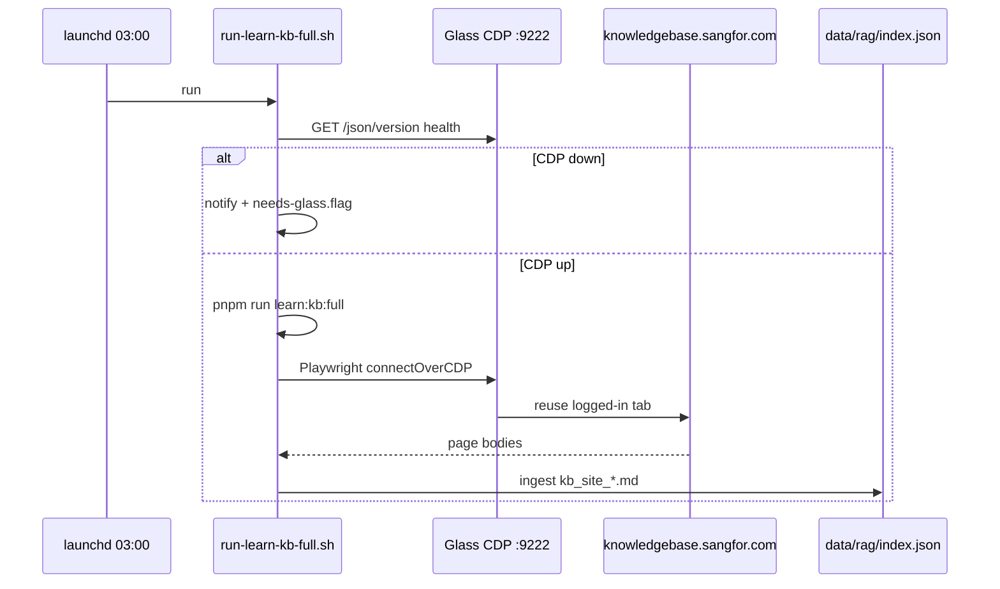

# Design: Daily KB learn via fixed Glass CDP

**Status:** Design + automation scripts (Phase 1)  
**Schedule:** 1× per day  
**Command:** `pnpm run learn:kb:full`  
**Session:** Cursor Glass browser — logged-in `knowledgebase.sangfor.com` tab

## Problem

- `learn:kb:full` discovery/crawl fails in headless Playwright with Login (`scripts/lib/kb-browser-session.ts`).
- Glass browser tab **already has** valid `library_token` + `token_by_code` + cookies.
- Manual token copy (Safari) drifts; daily automation needs a **stable attach point**.

## Decision

| Item | Value |
|------|--------|
| CDP URL | **Fixed** `http://127.0.0.1:9222` (override via env only for dev) |
| Frequency | **Daily 1×** at 03:00 (after `learn:all` at 02:00) |
| On auth failure | macOS notification + `needs-relogin.flag` (reuse existing pattern) |
| Crawl mode | Full pipeline: discover (if session ready) → crawl all site-map URLs → RAG ingest |

## Architecture



## Fixed CDP configuration

**`.env` (committed example only):**

```bash
# Glass / Chrome remote debugging — fixed for daily automation
SANGFOR_CDP_URL=http://127.0.0.1:9222
SANGFOR_GLASS_CDP_REQUIRED=1
```

**Code defaults** (`scripts/lib/kb-browser-session.ts`):

- Default `SANGFOR_CDP_URL` to `http://127.0.0.1:9222` when `SANGFOR_GLASS_CDP_REQUIRED=1`.
- `launchKbBrowser()`: if CDP connect fails, throw clear error (no silent headless fallback in automation mode).

## Glass / Cursor prerequisites

1. **Enable remote debugging** on the Glass browser process (port **9222**).
2. Keep **one tab** on `https://knowledgebase.sangfor.com/home` logged in as partner.
3. Machine awake at 03:00 (or use `pmset` / power adapter).

> Cursor Glass CDP: confirm in Cursor settings that the embedded browser exposes CDP on 9222. If port differs, set `SANGFOR_CDP_URL` once — automation README documents the canonical port.

## Session stabilization (Phase 1b)

### A. CDP-first (immediate)

Already in `kb-browser-session.ts` — connect to existing KB tab, skip token injection.

### B. storageState snapshot (Phase 2)

After successful manual login via Playwright:

```typescript
await context.storageState({ path: 'data/runtime/kb-storage-state.json' });
```

- `prepareKbPage()` loads storageState when CDP unavailable (fallback for CI).
- Nightly job prefers CDP; storageState is **backup** after `relogin-and-rerun.sh`.

### C. Token refresh hook

Before crawl:

```bash
pnpm run login:one:safari   # updates library_token + token_by_code in .env
```

Daily script order:

1. `login:one:safari` (non-interactive if Safari session valid)
2. `verify:one`
3. `learn:kb:full` with CDP

If Safari tokens stale → notification, skip crawl (avoid polluting RAG with Login shells).

## Automation files

| File | Role |
|------|------|
| `automation/scripts/run-learn-kb-full.sh` | Daily runner, CDP health, learn:kb:full |
| `automation/com.jmpark.sangfor.learnkb.plist` | launchd 03:00 |
| `automation/scripts/relogin-and-rerun.sh` | Extended: optional `learn:kb:full` after learn:all |
| `data/runtime/needs-glass.flag` | CDP not reachable |
| `data/runtime/needs-relogin.flag` | Auth failure (existing) |

### Environment overrides

```bash
SANGFOR_REPO_DIR=...
SANGFOR_LOG_DIR=~/Library/Logs/sangfor-engineer-mcp
SANGFOR_CDP_URL=http://127.0.0.1:9222
SANGFOR_KB_FULL_MAX=0          # 0 = no cap
SANGFOR_KB_SKIP_DISCOVER=0     # 1 = --crawl-only
```

## Failure handling

| Signal | Action |
|--------|--------|
| CDP connection refused | `needs-glass.flag` + notify "Glass CDP 9222 열기" |
| `waitForKbReady` false | notify + `needs-relogin.flag` |
| `pagesCrawled < 10` | warn in log; do not delete existing index |
| Login shell in body | skip chunk (existing filter); metric `loginShellSkipped` |

## Metrics (log JSON line)

```json
{
  "job": "learn:kb:full",
  "siteMapArticles": 80,
  "pagesCrawled": 75,
  "loginShellSkipped": 2,
  "cdp": "http://127.0.0.1:9222",
  "durationMs": 120000
}
```

## Rollout phases

### Phase 1 — Automation shell (this PR)

- `run-learn-kb-full.sh` + plist at 03:00
- Docs + `.env.example` CDP defaults
- `package.json`: `"learn:kb:daily": "tsx scripts/learn-kb-full-site.ts"`

### Phase 2 — storageState + CDP health tool

- `scripts/check-glass-cdp.ts` — ping CDP, list tabs, verify KB URL
- Save/load `kb-storage-state.json`

### Phase 3 — Combined nightly pipeline

- Single plist or master script: `learn:all` → `learn:kb:full` → `rag:reembed` (post semantic RAG)

## Operator runbook

**Daily (automatic):** launchd at 03:00.

**If notification "Glass CDP":**

1. Open Cursor Glass browser panel.
2. Navigate to KB home (logged in).
3. Run: `pnpm run check:glass-cdp` (Phase 2) or `launchctl kickstart ... learnkb`.

**If notification "재로그인":**

```bash
./automation/scripts/relogin-and-rerun.sh
./automation/scripts/run-learn-kb-full.sh
```

## Risks

| Risk | Mitigation |
|------|------------|
| Mac asleep at 03:00 | `caffeinate` wrapper or earlier schedule |
| Glass not running | `needs-glass.flag`; doc prominently |
| CDP port conflict | Fixed 9222; check `lsof -i :9222` in health script |
| RAG hash quality until Phase 2 RAG | Accept; semantic reembed follows |

## Related

- `scripts/learn-kb-full-site.ts`
- `scripts/lib/kb-browser-session.ts`
- `docs/OSS_GAP_ANALYSIS.md`
