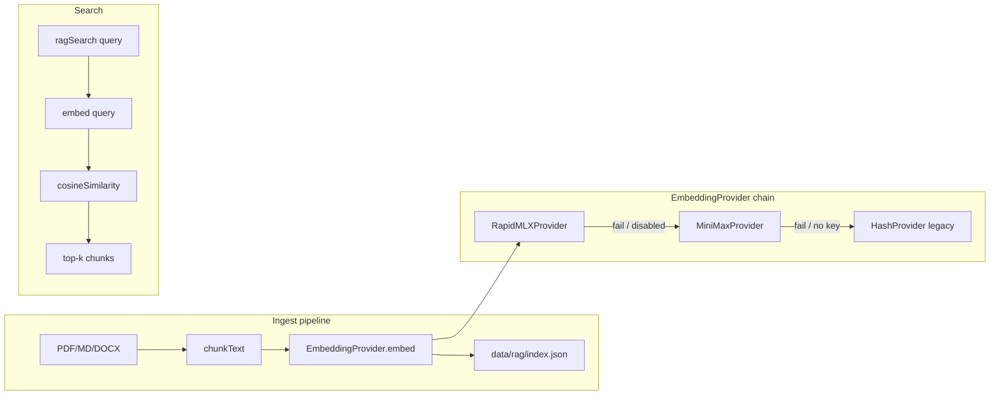

# Design: Semantic RAG (Rapid-MLX + MiniMax cloud)

**Status:** Design (implementation Phase 1–3)  
**Replaces:** `hashEmbedding()` default in `packages/sangfor-rag`  
**Owner decision:** Local **Rapid-MLX** primary; **MiniMax (mino)** cloud fallback

## Goals

1. Improve `sangfor.rag_search` / `sangfor.search_manuals` recall on paraphrased Sangfor queries (Korean + English).
2. Keep **offline-capable** ingest on Apple Silicon when Rapid-MLX is running.
3. Allow **cloud fallback** when local MLX is down, batch is large, or dimensions must match production.
4. Preserve **backward compatibility**: existing `data/rag/index.json` must re-embed or dual-read during migration.

## Non-goals (this phase)

- Vector DB migration (Qdrant/pgvector) — stay on JSON index until chunk count > ~50k.
- Multimodal embeddings (PDF images, diagrams).
- Sending raw KB article text to cloud without env opt-in.

## Architecture



## Provider interface

New module: `packages/sangfor-rag/src/embedding-provider.ts`

```typescript
export type EmbeddingBackend = 'rapid-mlx' | 'minimax' | 'hash';

export interface EmbeddingProvider {
  readonly name: EmbeddingBackend;
  readonly dimensions: number;
  embed(texts: string[]): Promise<number[][]>;
  healthCheck(): Promise<{ ok: boolean; detail?: string }>;
}

export function createEmbeddingProviderFromEnv(): EmbeddingProvider;
```

### Selection logic (`SANGFOR_EMBEDDING_PROVIDER`)

| Value | Behavior |
|-------|----------|
| `rapid-mlx` (default on darwin) | Try Rapid-MLX; on failure → MiniMax if key set → hash |
| `minimax` | MiniMax only; hash on failure |
| `hash` | Legacy SHA buckets (CI / air-gap) |

Chain is explicit in logs: `embeddingBackend: "rapid-mlx" | fallback: "minimax"`.

## Rapid-MLX (local primary)

- Server: [Rapid-MLX](https://github.com/raullenchai/Rapid-MLX) OpenAI-compatible API.
- Endpoint: `POST {base}/embeddings` per OpenAI schema.

**Recommended startup (macOS):**

```bash
pip install 'rapid-mlx[embeddings]'
rapid-mlx serve \
  --embedding-model mlx-community/nomic-embed-text-v1.5-4bit \
  --port 8000
```

**Env (`.env`):**

```bash
SANGFOR_EMBEDDING_PROVIDER=rapid-mlx
SANGFOR_RAPID_MLX_BASE_URL=http://127.0.0.1:8000/v1
SANGFOR_RAPID_MLX_EMBEDDING_MODEL=mlx-community/nomic-embed-text-v1.5-4bit
SANGFOR_RAPID_MLX_API_KEY=          # optional if server uses --api-key
SANGFOR_RAPID_MLX_TIMEOUT_MS=120000
SANGFOR_RAPID_MLX_BATCH_SIZE=16
```

**Implementation notes:**

- Batch `input: string[]` in one request when API allows; else chunk batches of 16.
- Cache embeddings by `contentHash` in index — skip re-embed on unchanged chunks.
- Store `embeddingBackend` + `embeddingModel` on each chunk for migration audits.

## MiniMax cloud (fallback)

User shorthand **mino** → **MiniMax** embedding/chat API (cloud).

**Env:**

```bash
SANGFOR_MINIMAX_API_KEY=
SANGFOR_MINIMAX_BASE_URL=https://api.minimax.chat/v1   # confirm against current MiniMax docs
SANGFOR_MINIMAX_EMBEDDING_MODEL=embo-01                # placeholder — set per account/docs
SANGFOR_MINIMAX_TIMEOUT_MS=60000
SANGFOR_ALLOW_CLOUD_EMBEDDINGS=1                       # required to send text off-machine
```

**Policy:**

- `SANGFOR_ALLOW_CLOUD_EMBEDDINGS=0` → never call MiniMax; fall back to hash after Rapid-MLX failure.
- Log chunk count + byte size before cloud batch; cap `SANGFOR_EMBEDDING_CLOUD_MAX_CHUNKS=500` per run.
- Do not embed files marked `trustLevel: customer` without explicit override.

**Rapid-MLX cloud routing:** Optional later — Rapid-MLX `--cloud-model` is for **LLM** prefill, not embeddings. Keep embedding providers separate in v1.

## Index schema migration

Extend `RagDocumentChunk`:

```typescript
interface RagDocumentChunk {
  // existing fields...
  vector: number[];
  embeddingBackend?: EmbeddingBackend;
  embeddingModel?: string;
  vectorDims?: number;
}
```

Bump `RagIndex.version` to `2` when any chunk has non-hash backend.

**Migration command (planned):**

```bash
pnpm run rag:reembed -- --provider rapid-mlx
```

Script walks `data/sources/raw/*.md` + existing index chunks, re-embeds, writes new index atomically.

## Integration points

| Caller | Change |
|--------|--------|
| `ingestDocument()` | `vector: await provider.embed([text])` |
| `ragSearch()` | Query embed via same provider chain |
| `learn:kb:full` / `ingest:browser` | No change (ingest path picks up provider) |
| `sangfor-planner` | Prefer `ragSearch` over `sangfor-knowledge` mock |
| MCP `sangfor.rag_index_summary` | Add `embeddingBackendCounts` |

## Testing strategy

| Test | Type |
|------|------|
| `HashProvider` deterministic dims | Unit (always) |
| `RapidMLXProvider` mock fetch | Unit with MSW/fetch mock |
| `MiniMaxProvider` skipped without key | Unit |
| Golden queries HCI/EPP | Integration — optional `SANGFOR_RUN_EMBEDDING_IT=1` |
| `pnpm test` default | Stays on `hash` — no network |

**Golden set (initial):**

- "HCI instant VM recovery" → expects Instant VM Recovery white paper chunk
- "Athena NDR SOAR playbook" → Cyber Command doc
- "aTrust SSO policy" → IAG-related chunk

## Rollout phases

### Phase 1 — Provider abstraction (1 PR)

- Add `embedding-provider.ts`, wire `ingestDocument` / `ragSearch`, default `hash`.
- Env parsing + health check script `scripts/check-embedding-providers.ts`.

### Phase 2 — Rapid-MLX + MiniMax (1 PR)

- Implement providers; `SANGFOR_ALLOW_CLOUD_EMBEDDINGS` gate.
- `pnpm run rag:reembed` for local dev.

### Phase 3 — Planner + eval (1 PR)

- Planner uses RAG only; add `tests/rag-retrieval.golden.test.ts` (gated).
- Document Rapid-MLX launch in `docs/LOCAL_SETUP.md`.

## Risks

| Risk | Mitigation |
|------|------------|
| Dimension mismatch after provider switch | `vectorDims` field + forced reembed |
| Rapid-MLX not running at 02:00 job | launchd dependency or MiniMax fallback in nightly job |
| MiniMax cost / latency | Batch limits + `ALLOW_CLOUD` flag |
| KB text leaves machine | Cloud embed only with explicit env; prefer local Rapid-MLX for KB ingest |

## Open items

- [ ] Confirm exact MiniMax embedding model id and base URL for your account.
- [ ] Pin Rapid-MLX version in `docs/LOCAL_SETUP.md`.
- [ ] Decide unified embedding model across local+cloud (same dims) vs reembed on switch.
