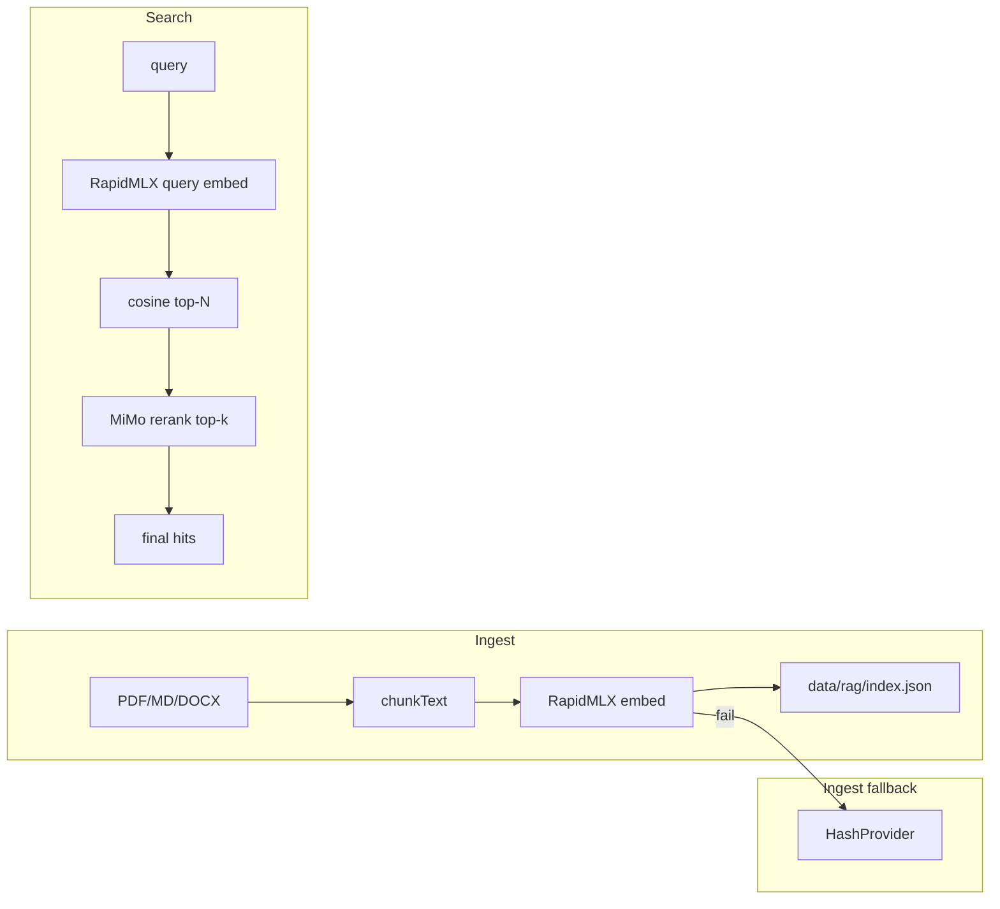

# Design: Semantic RAG (Rapid-MLX + Xiaomi MiMo cloud)

**Status:** Implemented (Phase 1–3)  
**Replaces:** `hashEmbedding()` default in `packages/sangfor-rag`  
**Owner decision:** Local **Rapid-MLX** primary; **Xiaomi MiMo** cloud augmentation (not MiniMax)

## Goals

1. Improve `sangfor.rag_search` / `sangfor.search_manuals` recall on paraphrased Sangfor queries (Korean + English).
2. Keep **offline-capable** ingest on Apple Silicon when Rapid-MLX is running.
3. Use **MiMo cloud** when local MLX is down or to **rerank** candidates (MiMo has chat API; embeddings API is not documented as of 2026-06).
4. Preserve **backward compatibility**: existing `data/rag/index.json` must re-embed or dual-read during migration.

## Non-goals (this phase)

- Vector DB migration (Qdrant/pgvector) — stay on JSON index until chunk count > ~50k.
- Multimodal embeddings (PDF images, diagrams).
- Sending full KB article bodies to MiMo without `SANGFOR_ALLOW_CLOUD_RAG=1`.

## Architecture



**Why rerank, not MiMo embed?**  
[Xiaomi MiMo API](https://platform.xiaomimimo.com/docs/en-US/quick-start/first-api-call) exposes OpenAI-compatible `POST /v1/chat/completions` (`https://api.xiaomimimo.com/v1`). Public SDKs (e.g. rig-core) mark MiMo **Embeddings = unsupported**. v1 cloud role is **reranking** top-N local candidates; we optionally probe `/v1/embeddings` at runtime if Xiaomi adds it later.

## Provider interface

Module: `packages/sangfor-rag/src/embedding-provider.ts`

```typescript
export type EmbeddingBackend = 'rapid-mlx' | 'mimo' | 'hash';

export interface EmbeddingProvider {
  readonly name: EmbeddingBackend;
  readonly dimensions: number;
  embed(texts: string[]): Promise<number[][]>;
  healthCheck(): Promise<{ ok: boolean; detail?: string }>;
}

export interface RerankProvider {
  readonly name: 'mimo';
  rerank(query: string, candidates: Array<{ id: string; text: string }>, topK: number): Promise<string[]>;
}
```

### Selection logic (`SANGFOR_EMBEDDING_PROVIDER`)

| Value | Behavior |
|-------|----------|
| `rapid-mlx` (default on darwin) | Rapid-MLX embed; ingest fallback → hash |
| `hash` | Legacy SHA buckets (CI / air-gap) |
| `mimo` | **Query-time only**: hash/rapid retrieval + MiMo rerank (no MiMo vectors for ingest in v1) |

Search chain (default): `rapid-mlx` embed query → cosine **top-40** → MiMo rerank → **top-8**.

## Rapid-MLX (local primary)

- Server: [Rapid-MLX](https://github.com/raullenchai/Rapid-MLX) — `POST /v1/embeddings`.

```bash
pip install 'rapid-mlx[embeddings]'
rapid-mlx serve \
  --embedding-model mlx-community/nomic-embed-text-v1.5-4bit \
  --port 8000
```

**Env:**

```bash
SANGFOR_EMBEDDING_PROVIDER=rapid-mlx
SANGFOR_RAPID_MLX_BASE_URL=http://127.0.0.1:8000/v1
SANGFOR_RAPID_MLX_EMBEDDING_MODEL=mlx-community/nomic-embed-text-v1.5-4bit
SANGFOR_RAPID_MLX_API_KEY=
SANGFOR_RAPID_MLX_TIMEOUT_MS=120000
SANGFOR_RAPID_MLX_BATCH_SIZE=16
```

- Cache vectors by `contentHash`; store `embeddingBackend` + `embeddingModel` on each chunk.

## Xiaomi MiMo cloud (rerank + optional embed probe)

**Platform:** [Xiaomi MiMo API Open Platform](https://platform.xiaomimimo.com/)  
**Pay-as-you-go base URL:** `https://api.xiaomimimo.com/v1`  
**Token Plan clusters:** `https://token-plan-cn.xiaomimimo.com/v1` (etc. — see subscription console)  
**Auth header:** `api-key: $MIMO_API_KEY` (OpenAI-compatible)

**Env:**

```bash
SANGFOR_MIMO_API_KEY=
SANGFOR_MIMO_BASE_URL=https://api.xiaomimimo.com/v1
SANGFOR_MIMO_CHAT_MODEL=mimo-v2.5-pro
SANGFOR_MIMO_TIMEOUT_MS=60000
SANGFOR_MIMO_RERANK_ENABLED=1
SANGFOR_MIMO_RERANK_CANDIDATES=40
SANGFOR_ALLOW_CLOUD_RAG=1          # required to send query + chunk snippets to MiMo
```

### Rerank prompt (v1)

Structured JSON response — MiMo scores each candidate 0–10 for relevance to Sangfor engineering query. Only send:

- User query
- Per candidate: `id`, `title`, first 400 chars of `text` (not full KB body)

Cap: `SANGFOR_MIMO_RERANK_MAX_CHARS=12000` total payload.

### Optional embed probe (future-proof)

On `createEmbeddingProviderFromEnv()` startup:

```http
POST {SANGFOR_MIMO_BASE_URL}/embeddings
```

If **200** → enable `MimoEmbeddingProvider` as ingest/query fallback. If **404/405** → rerank-only (documented default).

### Policy

- `SANGFOR_ALLOW_CLOUD_RAG=0` → never call MiMo; local Rapid-MLX + hash only.
- Skip `trustLevel: customer` chunks in rerank payload unless `SANGFOR_ALLOW_CLOUD_RAG_CUSTOMER=1`.
- Token Plan usage: respect Xiaomi terms (coding-tool oriented quotas).

## Index schema migration

```typescript
interface RagDocumentChunk {
  vector: number[];
  embeddingBackend?: 'rapid-mlx' | 'mimo' | 'hash';
  embeddingModel?: string;
  vectorDims?: number;
}
```

`RagIndex.version` → `2` when non-hash vectors present.

```bash
pnpm run rag:reembed -- --provider rapid-mlx
```

## Integration points

| Caller | Change |
|--------|--------|
| `ingestDocument()` | Rapid-MLX embed (fallback hash) |
| `ragSearch()` | Rapid-MLX query embed + optional MiMo rerank |
| MCP `sangfor.rag_index_summary` | `embeddingBackendCounts`, `mimoRerankEnabled` |

## Testing

| Test | Type |
|------|------|
| HashProvider | Unit (always) |
| RapidMLXProvider | Unit mock fetch |
| MimoRerankProvider | Unit mock; live gated `SANGFOR_RUN_MIMO_IT=1` |
| Golden queries HCI/EPP | Integration gated |

## Rollout phases

### Phase 1 — Provider abstraction

- `embedding-provider.ts` wired; default `hash`.

### Phase 2 — Rapid-MLX + MiMo rerank

- `RapidMLXProvider`, `MimoRerankProvider`, `SANGFOR_ALLOW_CLOUD_RAG` gate.
- `pnpm run rag:reembed`.

### Phase 3 — Planner + eval

- Planner uses RAG only; golden retrieval tests.

## Risks

| Risk | Mitigation |
|------|------------|
| MiMo no `/v1/embeddings` | Rerank-only v1; embed probe for future |
| Rapid-MLX down at night | Hash retrieval still works; MiMo rerank optional |
| Cloud data residency | Snippet-only rerank; ALLOW flag |
| MiMo latency | Rerank only top-40; timeout + skip rerank on error |

## Open items

- [ ] Confirm pay-as-you-go vs Token Plan base URL for your account.
- [ ] Pin Rapid-MLX version in `docs/LOCAL_SETUP.md`.
- [ ] Re-test MiMo `/v1/embeddings` when platform docs update.
